# Assignment 10 - Kubernetes Pods, ReplicaSets & Deployments

## 1. Cluster Baseline & Standalone Pod

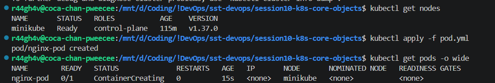
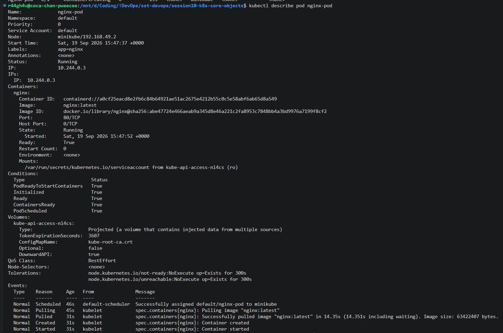
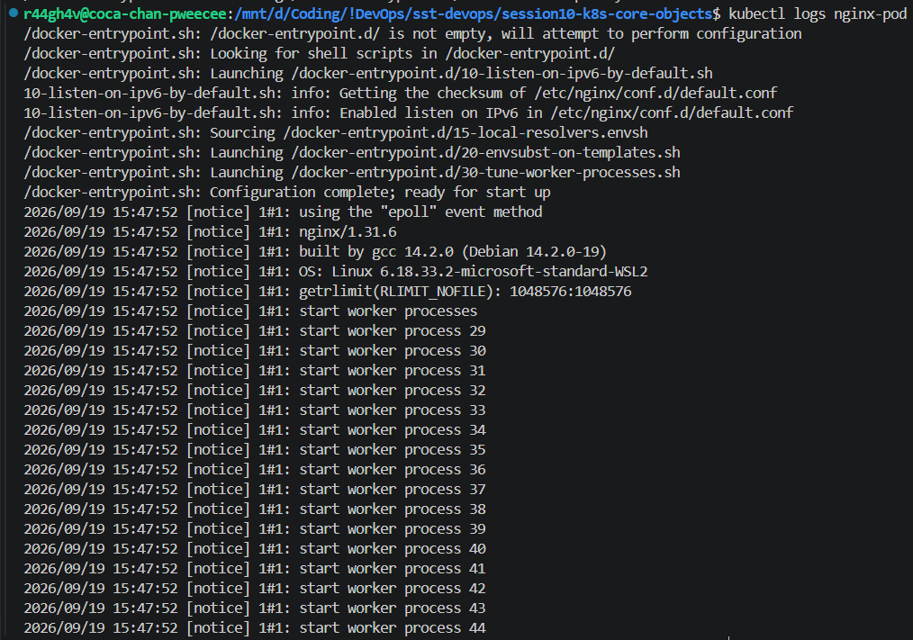

## 2. Service, Port Forwarding, Deployment & Scaling

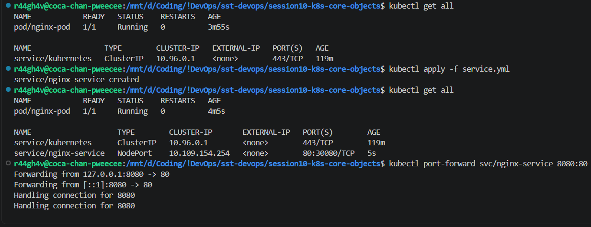
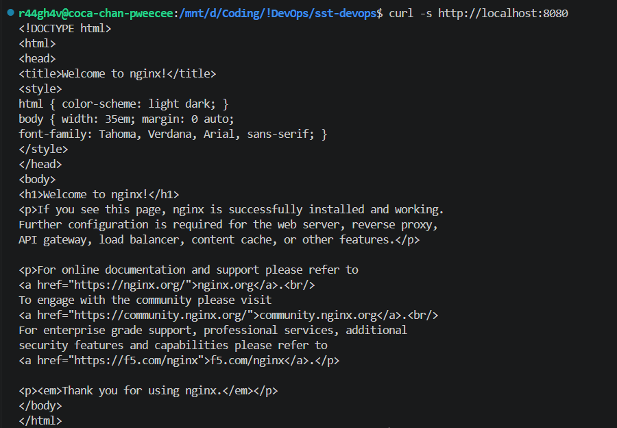
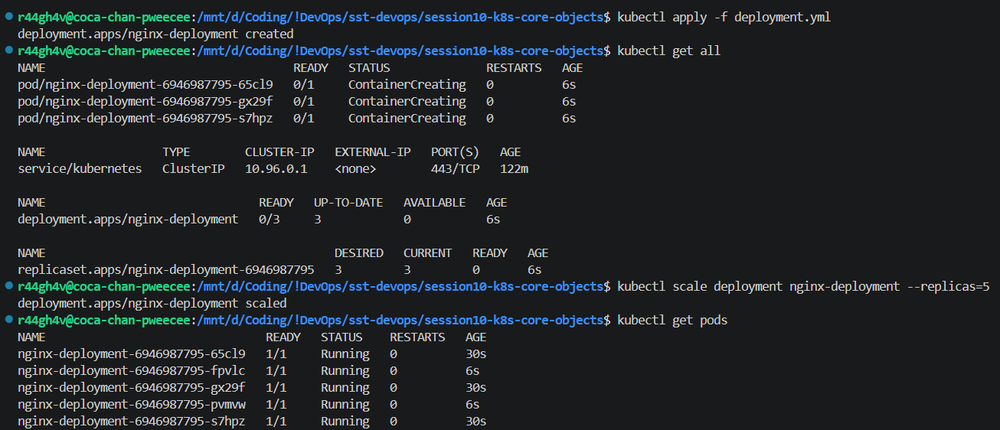

## 3. Pod Lifecycle States & Probes

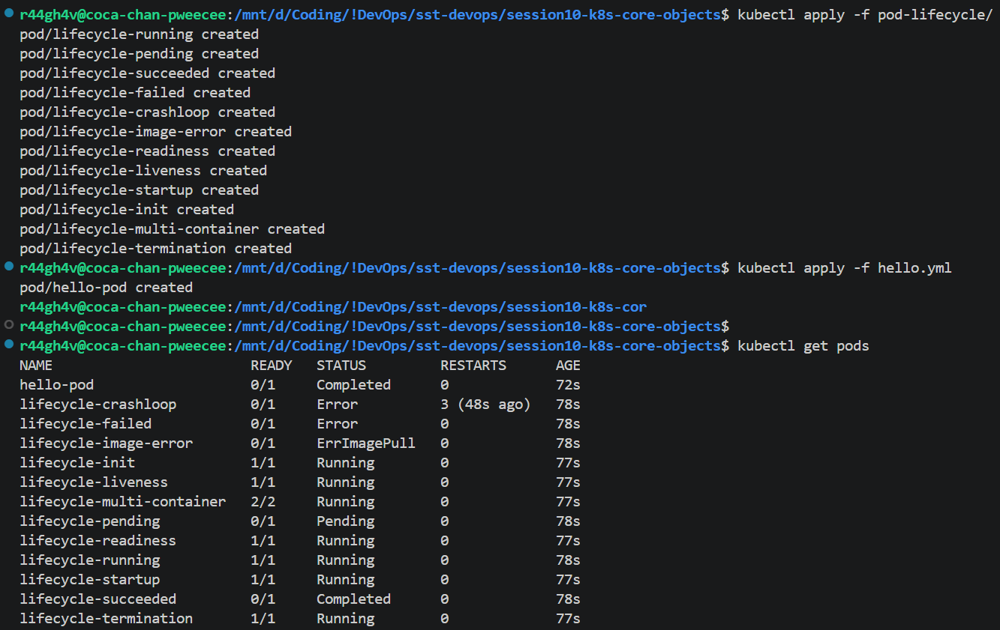

## 4. ReplicaSet, StatefulSet & DaemonSet

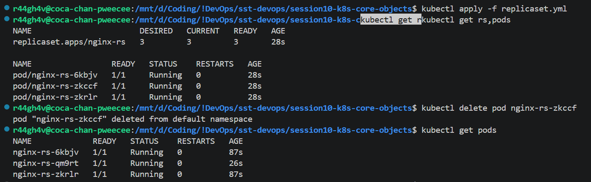
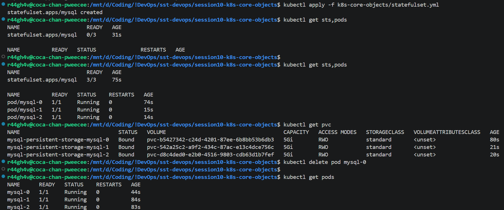
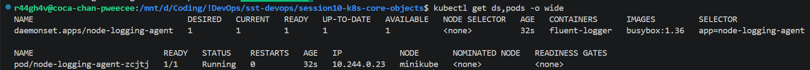

## 5. Rolling Updates & Rollback (v1 to v4 to v1)

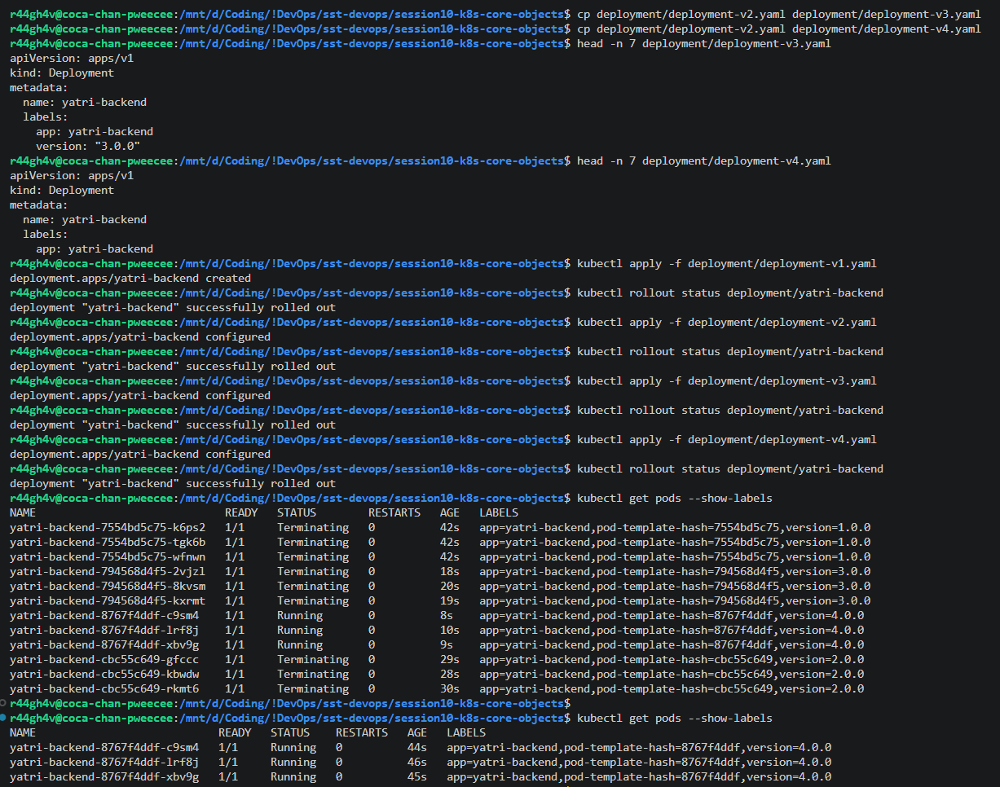
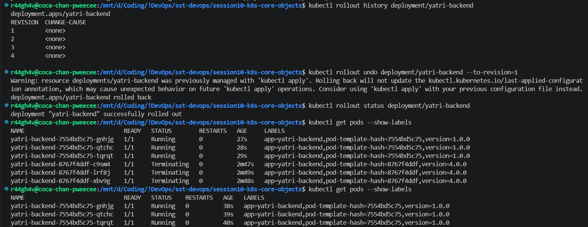

## 6. Troubleshooting

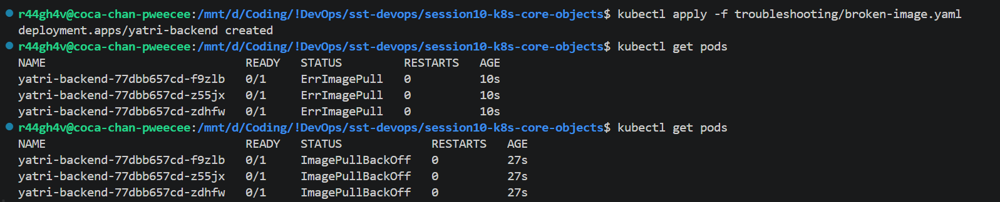
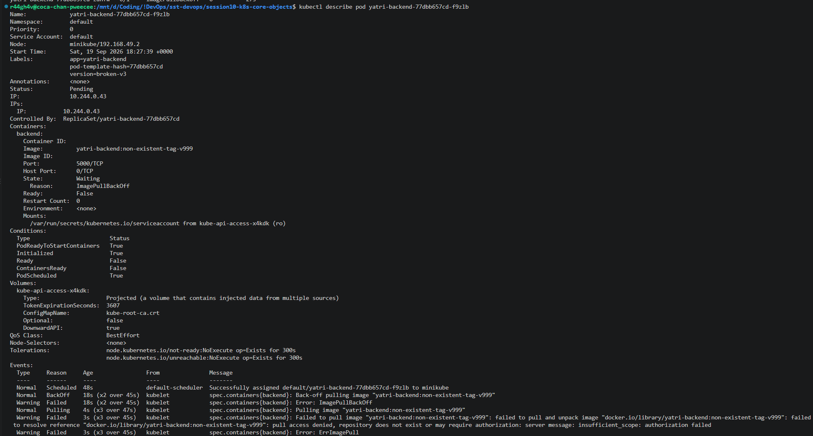

## 7. Blue-Green Deployment

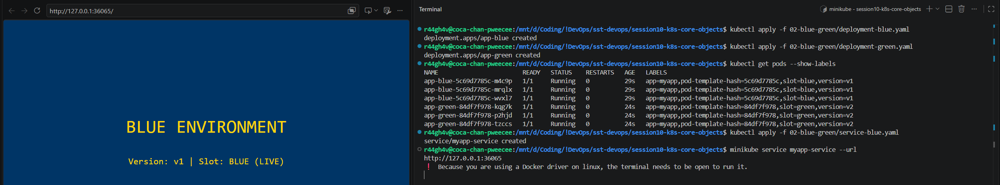
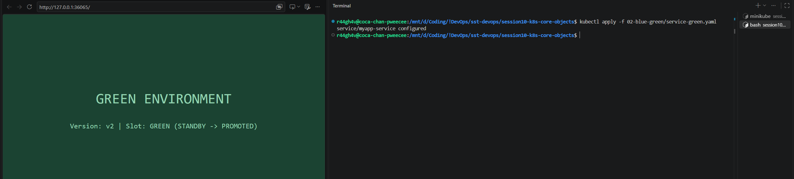

## 8. Canary Deployment

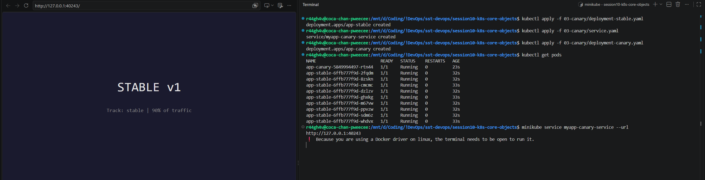
ts took me too many tries
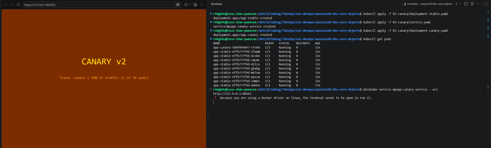
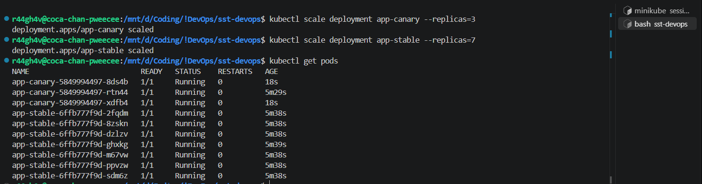

## 9. Recreate Deployment & the Downtime Window

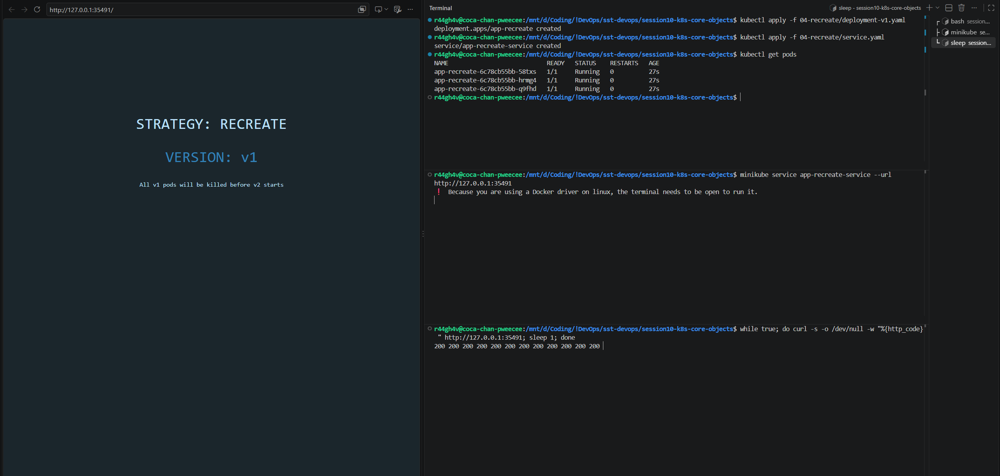
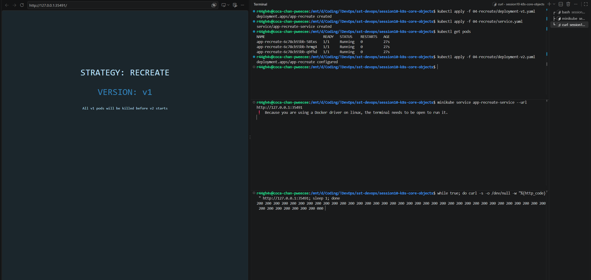
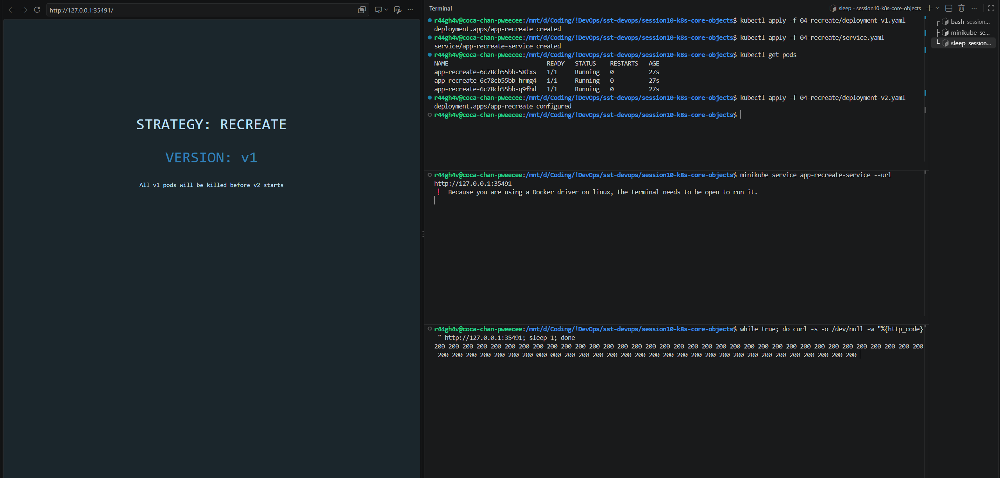

## 10. ReplicaSet vs Deployment

A ReplicaSet keeps N pods running but keeps no history - to change version you scale one up and the other down yourself.

A Deployment saves the history like version control (revision 1, 2, 3), which is what makes `kubectl rollout undo` work. `--to-revision=1` jumps straight back to v1.

## 11. The 4 Deployment Strategies

| Strategy | What happens |
| :-- | :-- |
| Rolling update | Pods replaced a few at a time. `maxSurge` = pods allowed above the replica count (3 replicas + surge 1 = 4). `maxUnavailable` = pods allowed to be down. |
| Blue-green | Two full environments running, switch traffic between them. Costs double the infrastructure. |
| Canary | Update one server out of ten (~10%), test it, then widen to 40% and more. |
| Recreate | Old pods removed first, new ones start after - there is downtime. |
