# Assignment 10 - Kubernetes Pods, ReplicaSets & Deployments

## 1. Cluster Baseline & Standalone Pod

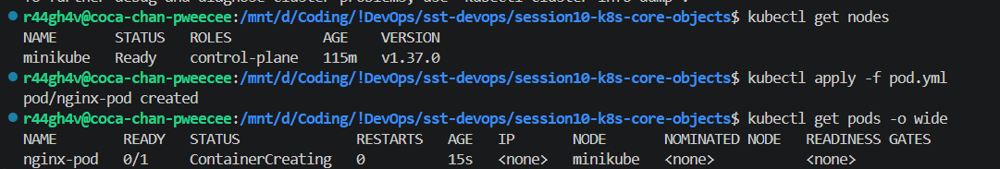
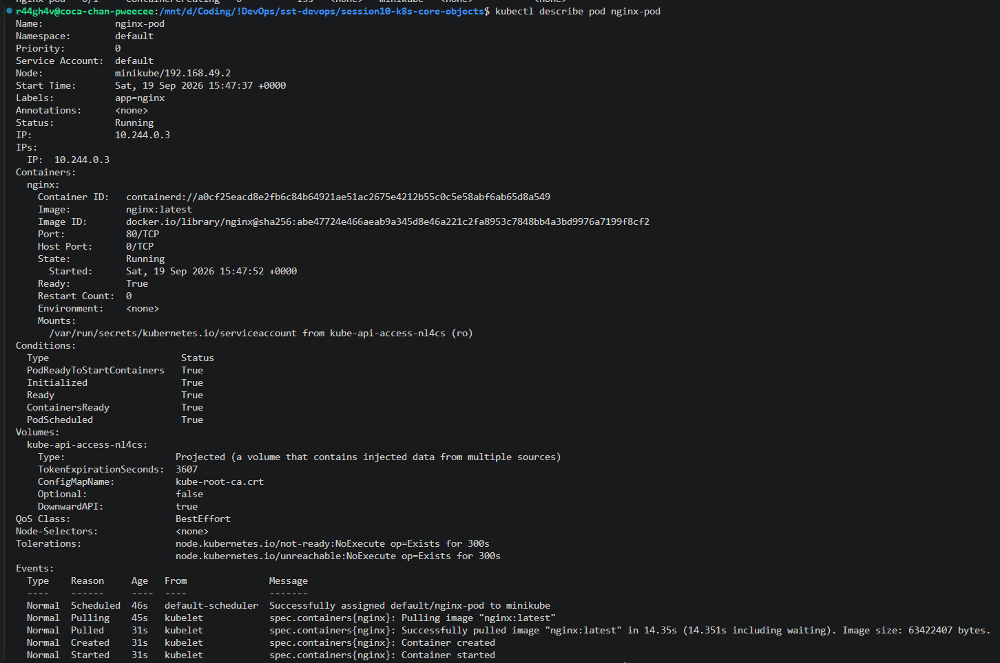
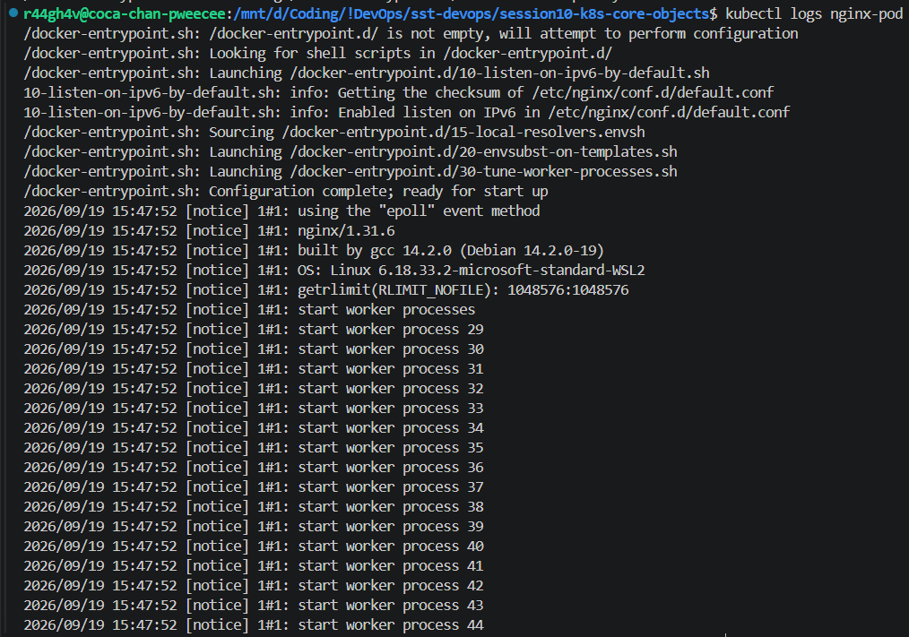

## 2. Service, Port Forwarding, Deployment & Scaling

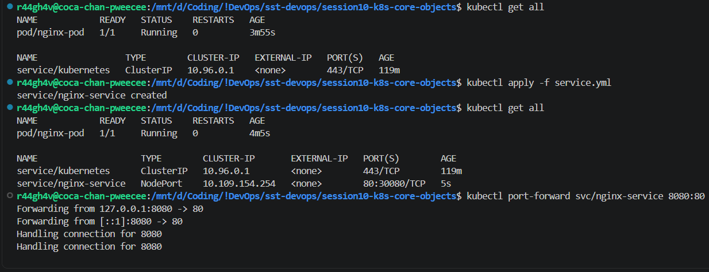
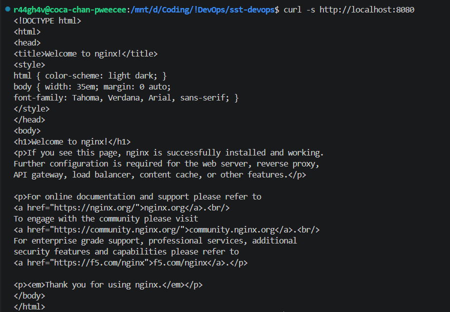
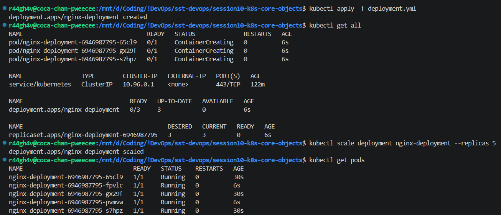

## 3. Pod Lifecycle States & Probes

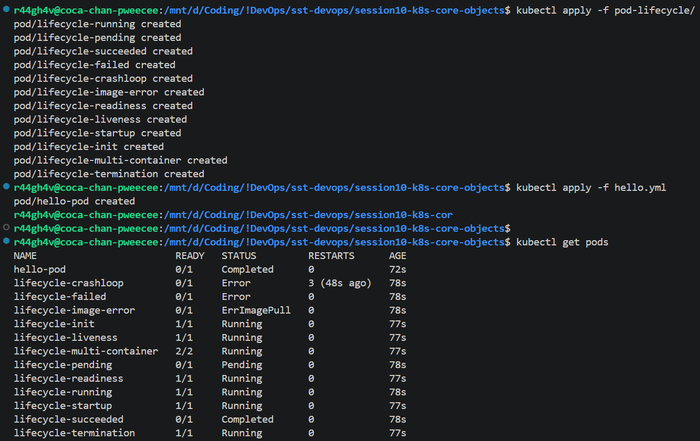

All 12 files in `pod-lifecycle/` applied at once, then `kubectl get pods`. What each one showed:

| Pod | STATUS | What I observed |
| :-- | :-- | :-- |
| lifecycle-running | Running 1/1 | Container started and stayed up - the normal state. |
| lifecycle-pending | Pending 0/1 | Requests more CPU/memory than the node has, so the scheduler cannot place it. `describe` shows the `FailedScheduling` event. |
| lifecycle-succeeded | Completed 0/1 | Container ran its command and exited with code 0. Pod phase is `Succeeded`, it is not restarted. |
| lifecycle-failed | Error 0/1 | Container exited with non-zero code and `restartPolicy: Never`. Pod phase is `Failed`. |
| lifecycle-crashloop | Error, restarts 3 | Container keeps crashing and kubelet keeps restarting it. After a few tries the status becomes `CrashLoopBackOff` as the restart delay grows. |
| lifecycle-image-error | ErrImagePull | Image does not exist, so the pull fails. It then turns into `ImagePullBackOff`. |
| lifecycle-init | Running 1/1 | Init container had to finish first, then the main container started. |
| lifecycle-readiness | Running 1/1 | Readiness probe decides if the pod gets traffic from a Service. |
| lifecycle-liveness | Running 1/1 | Liveness probe - if it fails, kubelet restarts the container. |
| lifecycle-startup | Running 1/1 | Startup probe gives a slow app time before liveness starts checking. |
| lifecycle-multi-container | Running 2/2 | Two containers in one pod, share network and start together. |
| lifecycle-termination | Running 1/1 | Shows graceful shutdown - on delete the container gets SIGTERM and a grace period before SIGKILL. |

Official pod phases are only `Pending`, `Running`, `Succeeded`, `Failed`, `Unknown`. `Completed`, `Error`, `CrashLoopBackOff` and `ImagePullBackOff` are just what `kubectl get pods` shows from the container state.

## 4. ReplicaSet, StatefulSet & DaemonSet

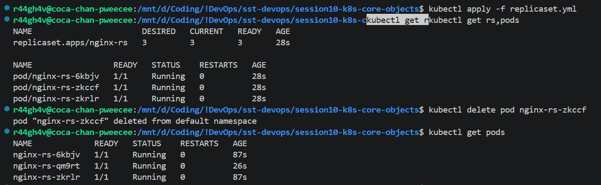
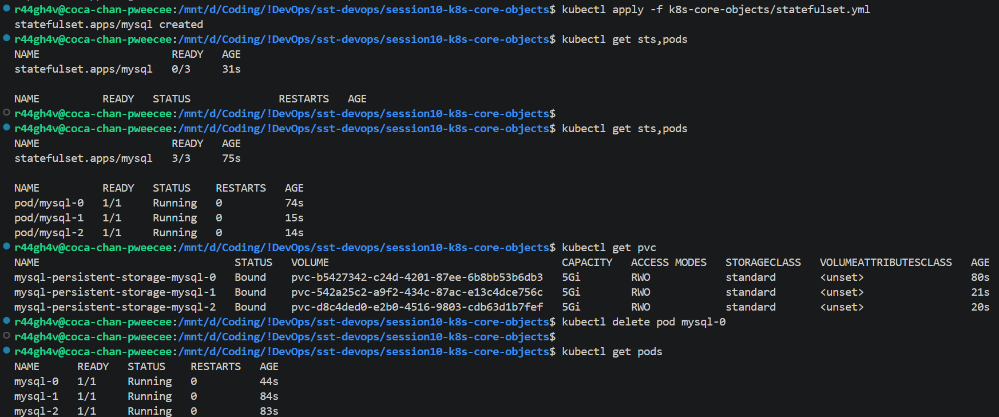
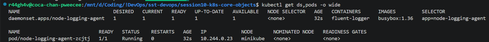

## 5. Rolling Updates & Rollback (v1 to v4 to v1)

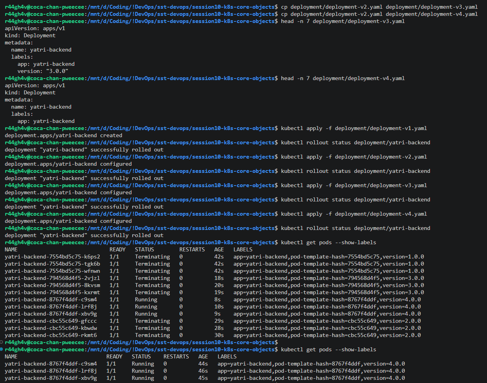
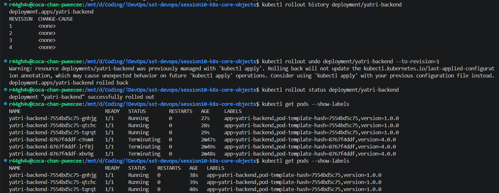

## 6. Troubleshooting

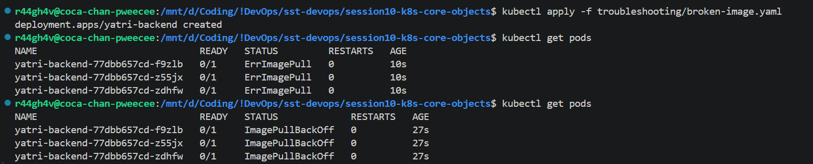
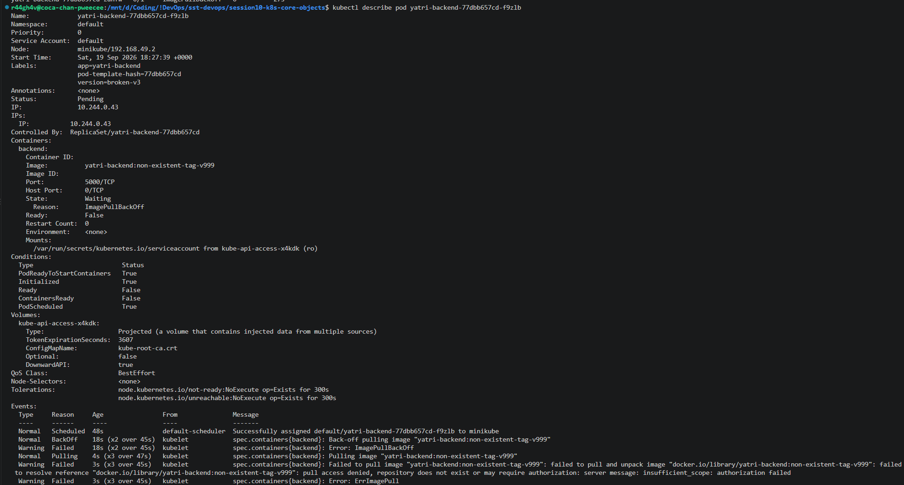

## 7. Blue-Green Deployment

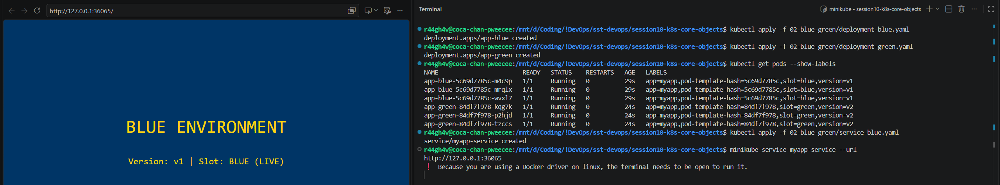
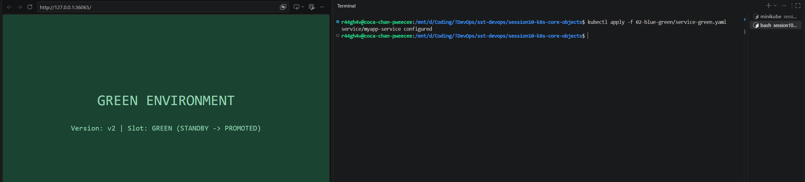

## 8. Canary Deployment

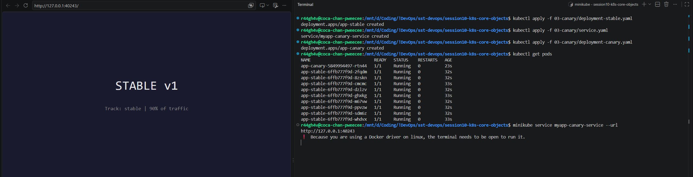
ts took me too many tries
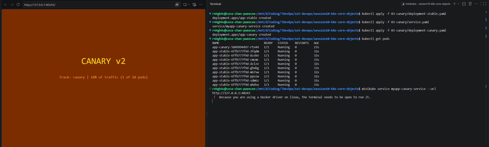
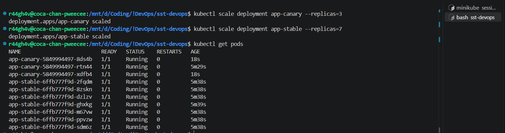

## 9. Recreate Deployment & the Downtime Window

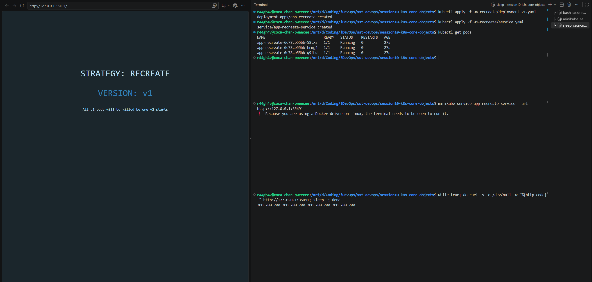
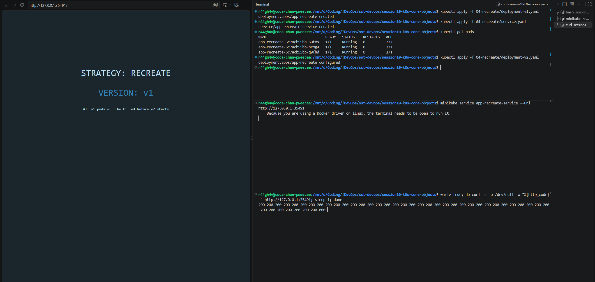
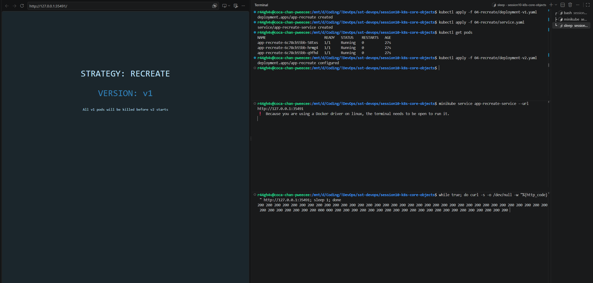

## 10. ReplicaSet vs Deployment

A ReplicaSet keeps N pods running but keeps no history - to change version you scale one up and the other down yourself.

A Deployment saves the history like version control (revision 1, 2, 3), which is what makes `kubectl rollout undo` work. `--to-revision=1` jumps straight back to v1.

## 11. The 4 Deployment Strategies

| Strategy | What happens |
| :-- | :-- |
| Rolling update | Pods replaced a few at a time. `maxSurge` = pods allowed above the replica count (3 replicas + surge 1 = 4). `maxUnavailable` = pods allowed to be down. |
| Blue-green | Two full environments running, switch traffic between them. Costs double the infrastructure. |
| Canary | Update one server out of ten (~10%), test it, then widen to 40% and more. |
| Recreate | Old pods removed first, new ones start after - there is downtime. |
