# Assignment 11 - Kubernetes Networking & Services

## 1. ClusterIP

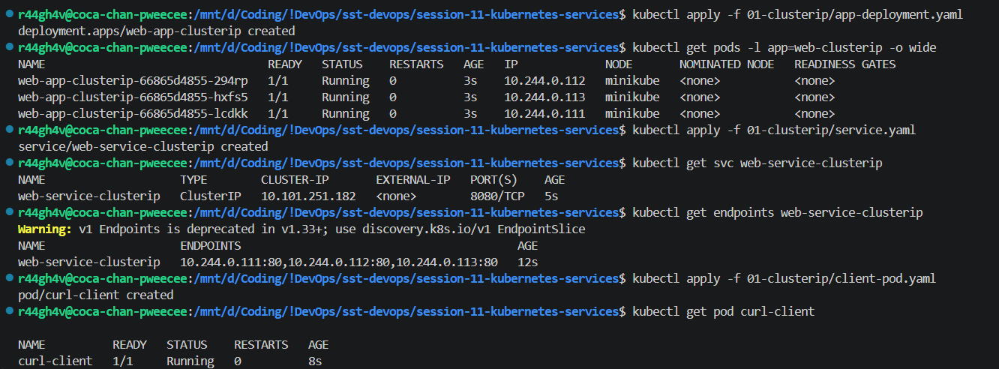
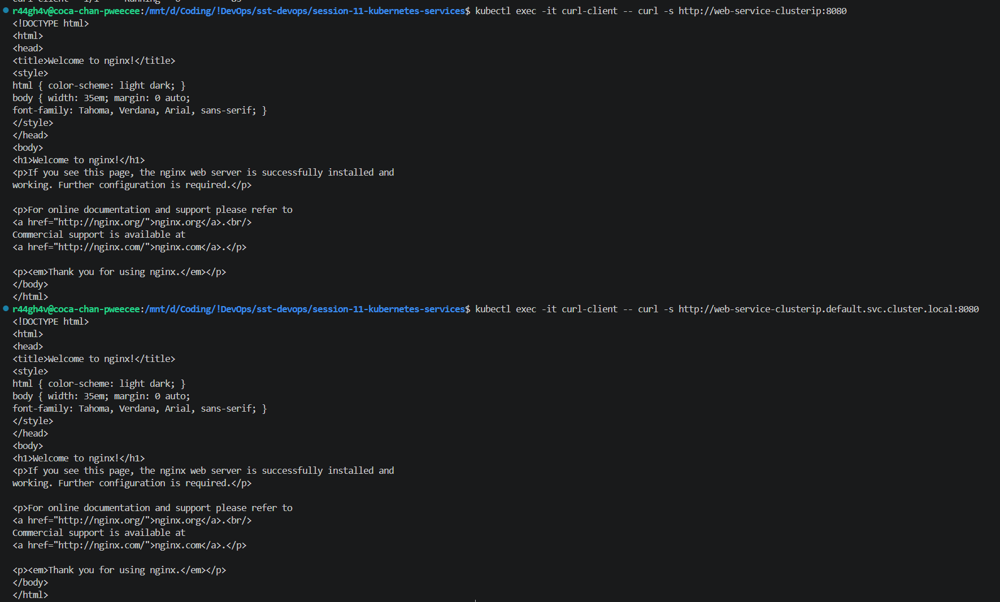
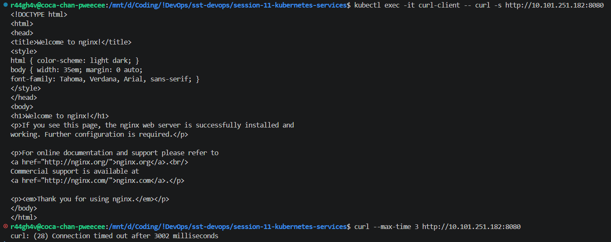

## 2. NodePort

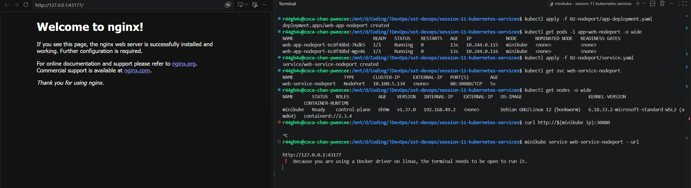

## 3. LoadBalancer

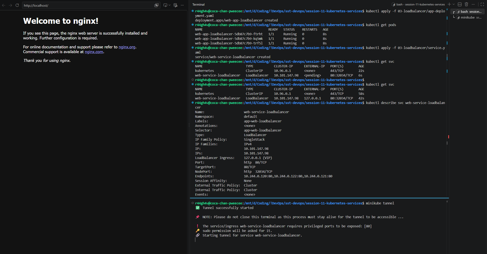
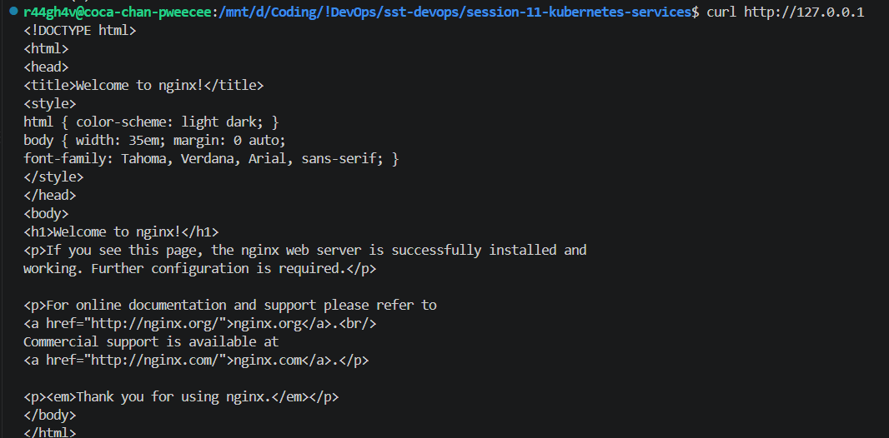

## 4. ExternalName

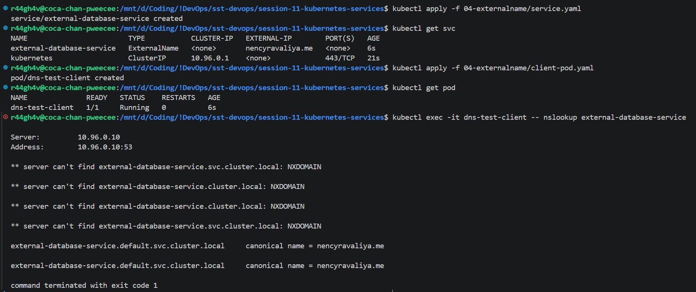

## 5. Headless

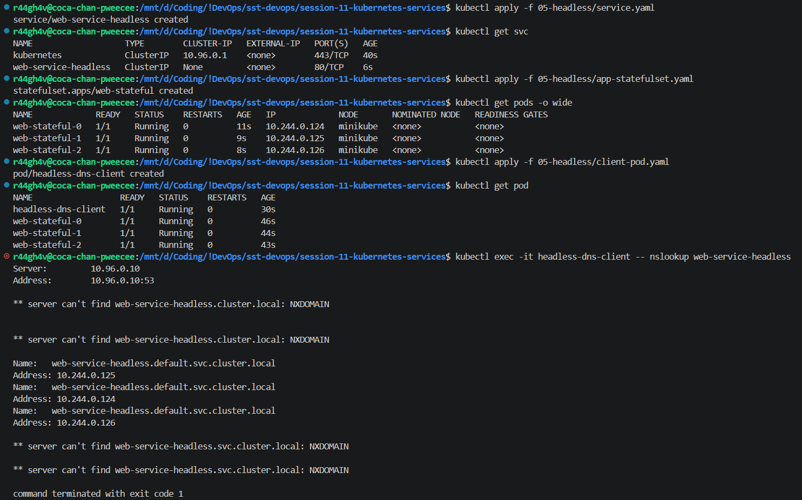
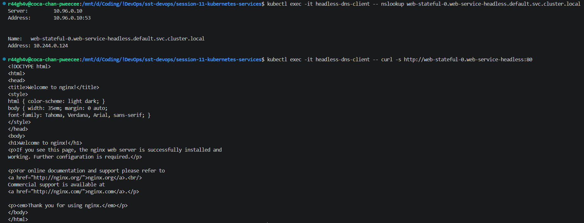

## 6. FQDN & CoreDNS

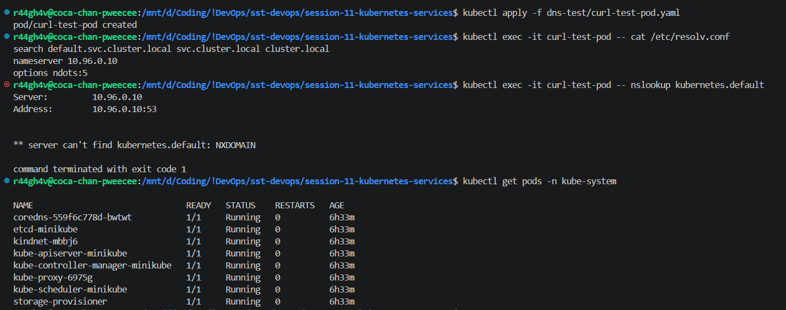

## 7. Pod Identity - Deployment vs StatefulSet

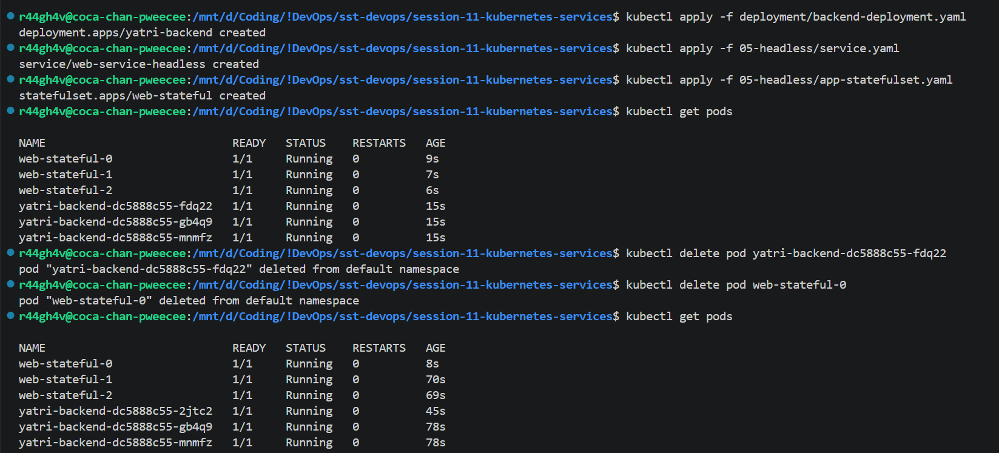

## 8. Comparison of the 5 Service Types

| Type | What it does |
| :-- | :-- |
| ClusterIP | Default. Internal only - needs port forwarding to reach from outside. |
| NodePort | Exposes the node's external IP, reachable from outside without port forwarding. |
| LoadBalancer | Gives an external IP on a cloud cluster. Simulated on Minikube with `minikube tunnel`. |
| ExternalName | Points the service at an external name instead of pods. |
| Headless (`clusterIP: None`) | Used with StatefulSets, where pods are addressed individually. |

One load balancer costs ~$10/month, so 10 services = 10 load balancers = $100/month. Ingress avoids that by managing all the services behind one entry point.

## 9. FQDN & CoreDNS

### What is FQDN?

The full name of a service: `<service>.<namespace>.svc.cluster.local` - e.g. `backend.dev.svc.cluster.local`. On a cloud cluster only the last part changes.

### Why do we need it?

Pod IPs keep changing, so services are reached by name.

### What is CoreDNS?

The cluster's DNS server, running as pods in `kube-system`.

### How does it resolve automatically?

Every pod's `/etc/resolv.conf` points at CoreDNS and carries a `search` list of the cluster suffixes, so typing just `backend` gets completed to the full name.

## 10. Deployment vs StatefulSet

Deployment pods get a random suffix - delete one and it returns with a different name.

StatefulSet pods are numbered `0, 1, 2` - delete `web-0` and it returns as `web-0` with the same storage.
