# Assignment 11 - Kubernetes Networking & Services

## 1. ClusterIP

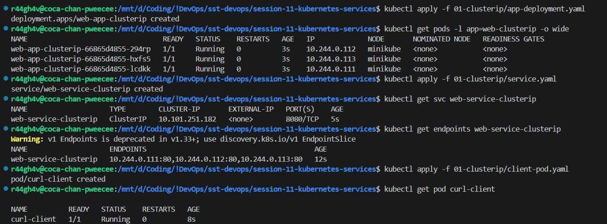
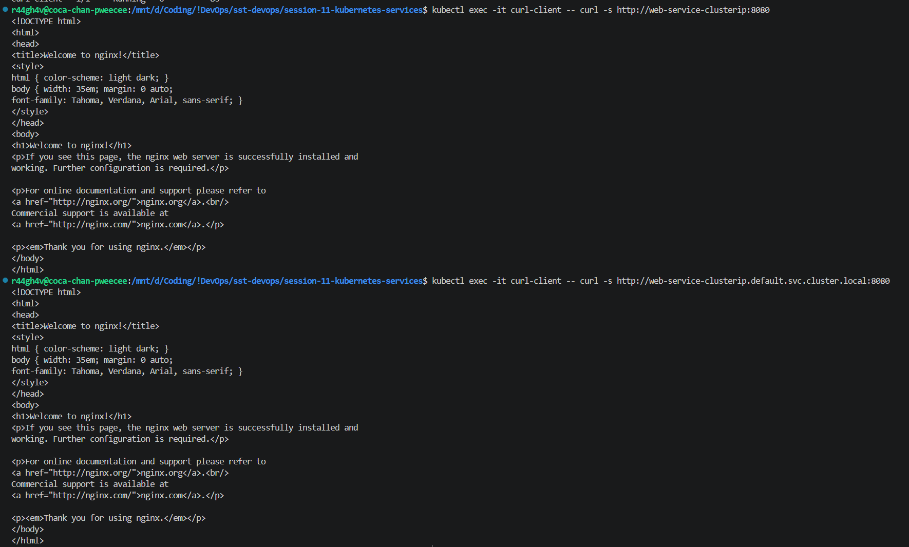
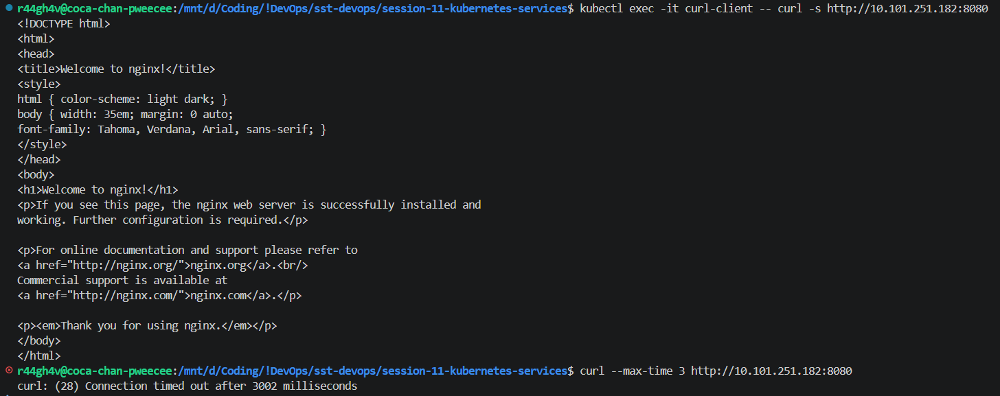

## 2. NodePort

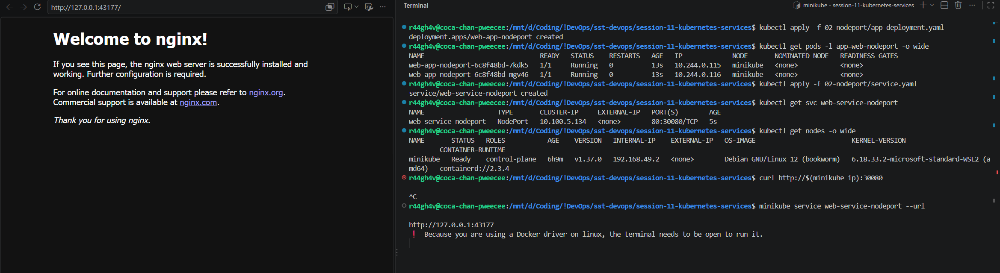

## 3. LoadBalancer

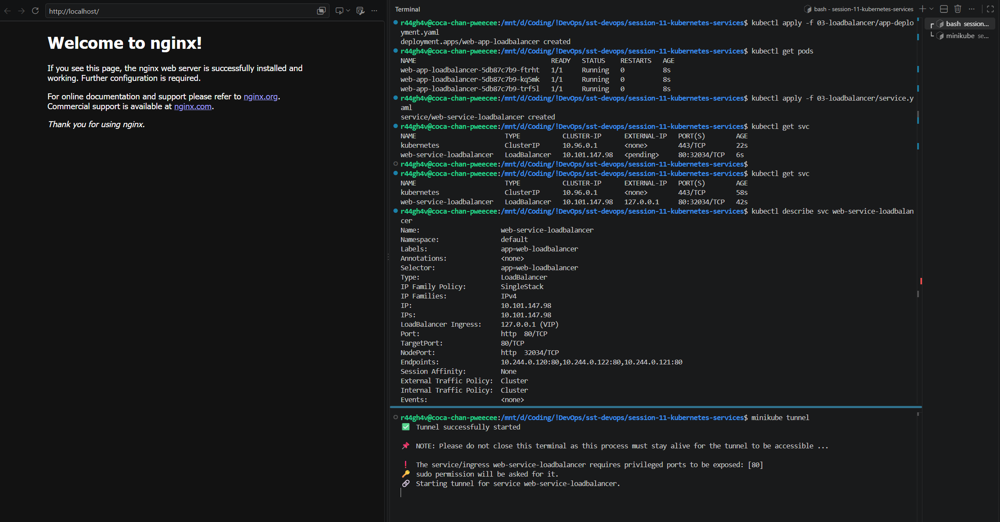
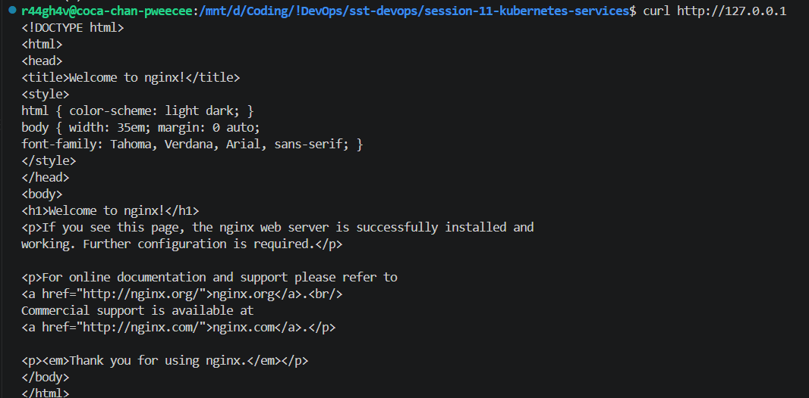

## 4. ExternalName

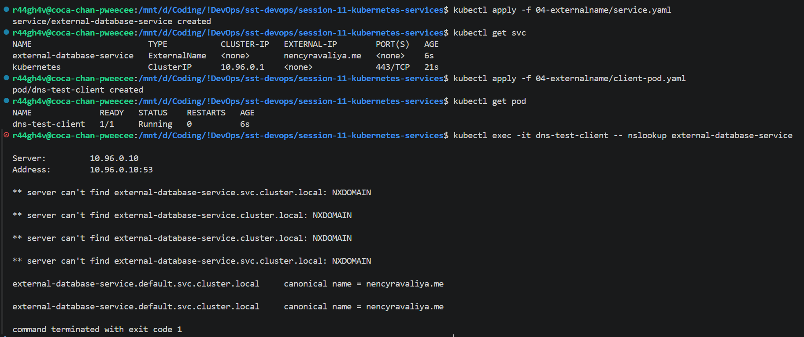

## 5. Headless

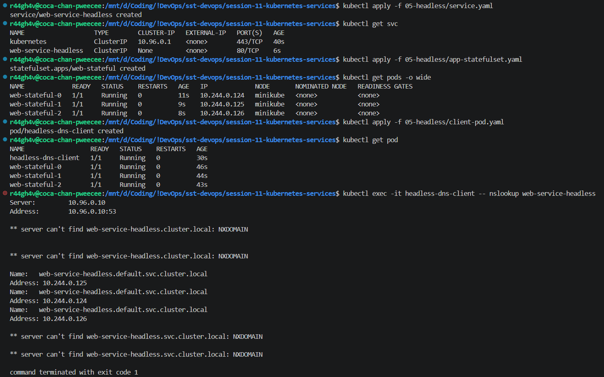
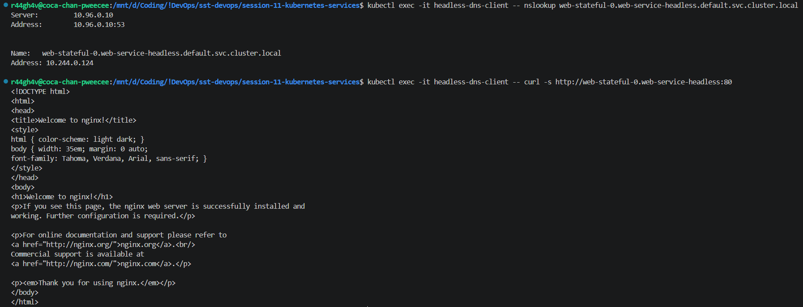

## 6. FQDN & CoreDNS

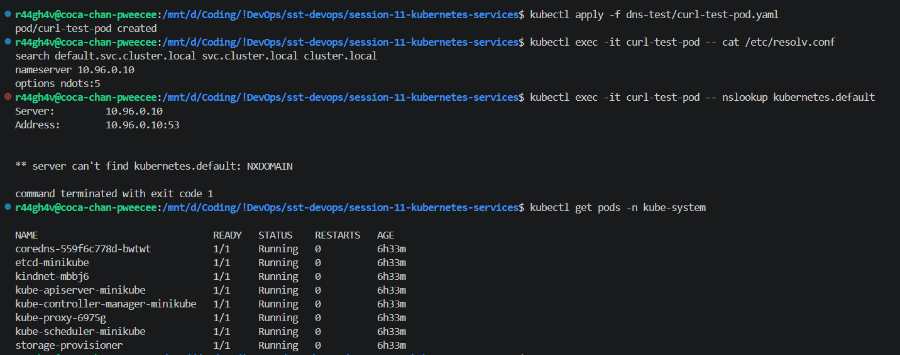

## 7. Pod Identity - Deployment vs StatefulSet

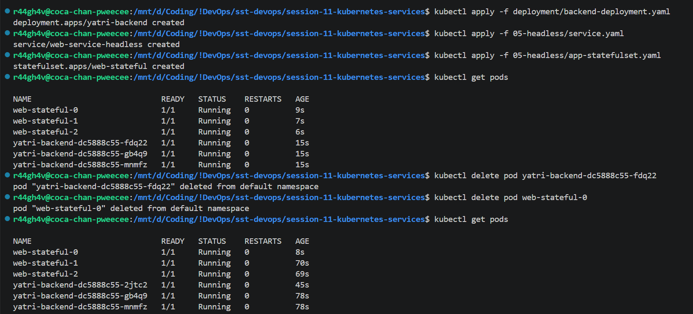

## 8. Comparison of the 5 Service Types

| Type | What it does |
| :-- | :-- |
| ClusterIP | Default. Internal only - needs port forwarding to reach from outside. |
| NodePort | Exposes the node's external IP, reachable from outside without port forwarding. |
| LoadBalancer | Gives an external IP on a cloud cluster. Simulated on Minikube with `minikube tunnel`. |
| ExternalName | Points the service at an external name instead of pods. |
| Headless (`clusterIP: None`) | Used with StatefulSets, where pods are addressed individually. |

One load balancer costs ~$10/month, so 10 services = 10 load balancers = $100/month. Ingress avoids that by managing all the services behind one entry point.

## 9. FQDN & CoreDNS

### What is FQDN?

The full name of a service: `<service>.<namespace>.svc.cluster.local` - e.g. `backend.dev.svc.cluster.local`. On a cloud cluster only the last part changes.

### Why do we need it?

Pod IPs keep changing, so services are reached by name.

### What is CoreDNS?

The cluster's DNS server, running as pods in `kube-system`.

### How does it resolve automatically?

Every pod's `/etc/resolv.conf` points at CoreDNS and carries a `search` list of the cluster suffixes, so typing just `backend` gets completed to the full name.

### Service discovery

CoreDNS watches the Kubernetes API; every new Service automatically gets a DNS record pointing to its ClusterIP.

### Namespace-based DNS

Same namespace: `backend` is enough. Another namespace: `backend.prod` or the full `backend.prod.svc.cluster.local`.

### Pod-to-Service communication

`curl http://backend` → name completed using the `search` list → CoreDNS returns the Service ClusterIP → kube-proxy forwards to one of the pods.

### FQDN examples

| Type | Example |
| :-- | :-- |
| Service | `backend.dev.svc.cluster.local` |
| StatefulSet pod via headless service | `web-0.web.default.svc.cluster.local` |
| Pod by IP | `10-244-0-5.default.pod.cluster.local` |

### CoreDNS configuration

Stored in the `coredns` ConfigMap in `kube-system` (the Corefile). The `kubernetes` plugin answers `cluster.local` names, `forward` sends everything else to the upstream DNS, `cache` caches answers.

### Troubleshooting DNS

- `kubectl get pods -n kube-system -l k8s-app=kube-dns` - CoreDNS running?
- `nslookup <service>` from a test pod, `cat /etc/resolv.conf`
- Name resolves but no response - check `kubectl get endpoints <service>` (selector mismatch).

## 10. Deployment vs StatefulSet

Deployment pods get a random suffix - delete one and it returns with a different name.

StatefulSet pods are numbered `0, 1, 2` - delete `web-0` and it returns as `web-0` with the same storage.

## 11. Object Comparison

### Deployment vs ReplicaSet

| | ReplicaSet | Deployment |
| :-- | :-- | :-- |
| Purpose | Keep N identical pods running | Manage the app's whole lifecycle |
| Pod management | Creates / replaces pods to match the count | Does not touch pods directly - creates ReplicaSets that do |
| Scaling | Yes, `replicas` | Yes, passes the change to its ReplicaSet |
| Rolling updates | No - change the image and nothing happens to existing pods | Yes - new ReplicaSet scaled up, old one scaled down, with `rollout undo` |

Relationship: Deployment → ReplicaSet → Pods. Every image change makes a new ReplicaSet; the old one is kept at 0 pods so rollback is possible. In practice a ReplicaSet is never created by hand.

### Deployment vs DaemonSet vs StatefulSet

| | Deployment | DaemonSet | StatefulSet |
| :-- | :-- | :-- | :-- |
| Use case | Stateless apps - web, API | One pod on every node - log collector, monitoring agent, kube-proxy | Stateful apps - databases, Kafka |
| Pod creation | Any order, random names (`web-7d9f-x2k`) | One per node automatically, no `replicas` | One by one in order, fixed names `web-0, web-1, web-2` |
| Scaling | Change `replicas` | Add a node and the pod appears | Change `replicas`, scales in order |
| Networking | Normal Service, pods interchangeable | Usually node-local access | Headless Service, each pod has its own DNS name |
| Storage | Shared or none | Usually hostPath for node logs | Own PVC per pod via `volumeClaimTemplates`, stays with the pod name |
| Example | nginx frontend | fluentd, node-exporter | MySQL, MongoDB |

### ReplicaSet vs Service

| ReplicaSet | Service |
| :-- | :-- |
| Responsible for **how many** pods exist - recreates a pod if it dies. | Responsible for **how to reach** the pods - one stable IP and DNS name. |
| Does not care about networking. | Does not care about creating pods. |

**Why a Service is needed:** a ReplicaSet replaces dead pods with new ones that have new IPs, so a client cannot rely on a pod IP.

**How traffic reaches pods:** client → Service name (CoreDNS gives the ClusterIP) → kube-proxy → one of the pods whose labels match the Service `selector` (listed in the Endpoints). The ReplicaSet and the Service never talk to each other; they are linked only through the same pod labels.
