# Assignment 12 - Kubernetes Ingress, ConfigMaps & Secrets

## 1. ConfigMap

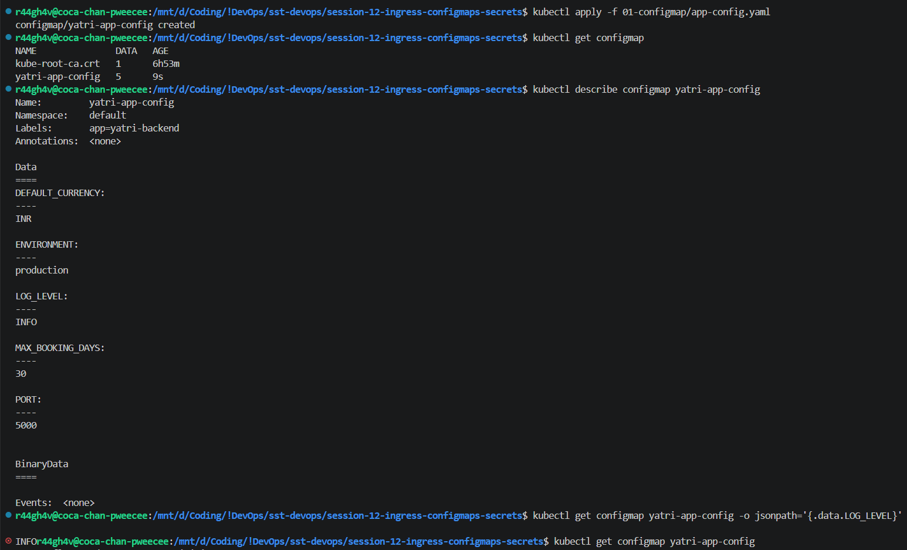

## 2. Secret

Apply, inspect (values masked as byte counts), decode the password:

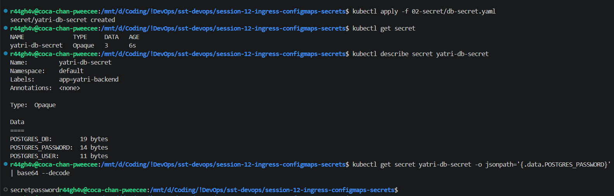

`echo` vs `echo -n` - plain `echo` appends a newline and encodes it too:

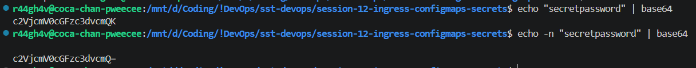

## 3. Injection & Per-Environment ConfigMaps

ConfigMap + Secret injected into the backend as environment variables:

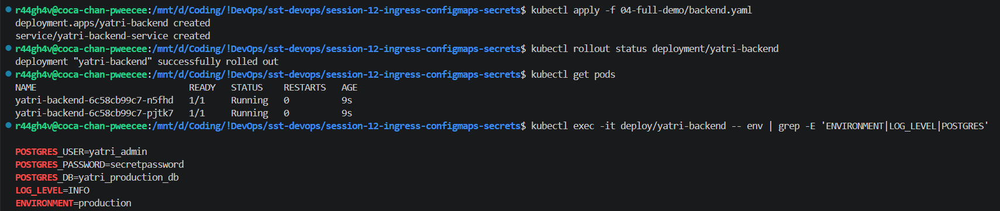

One ConfigMap per environment - dev / staging / prod:

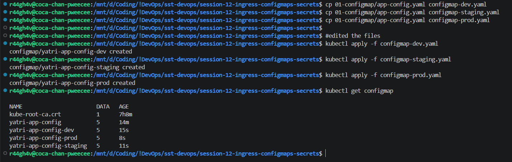

## 4. Ingress Controller & Local DNS

NGINX Ingress Controller running:

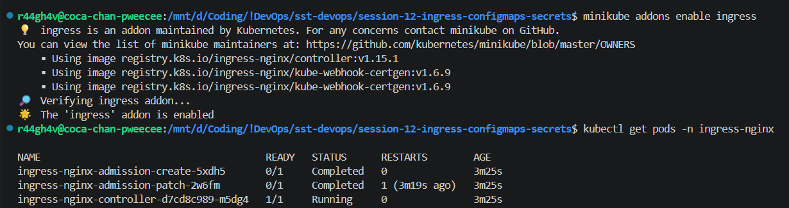

Hostnames mapped in `/etc/hosts`:

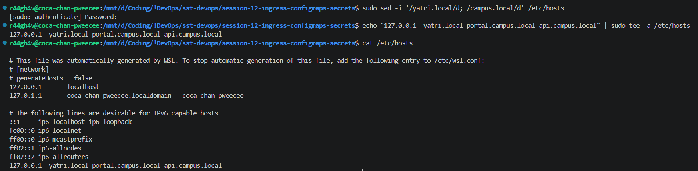

Port-forward to the ingress controller - the minikube bridge IP is not routable from WSL2, so the ingress is reached on `127.0.0.1:8080`:

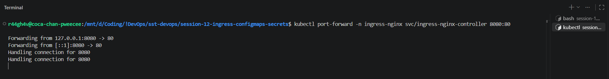

## 5. Path-Based & Host-Based Routing

Path-based ingress - one host, `/` to frontend and `/api` to backend:

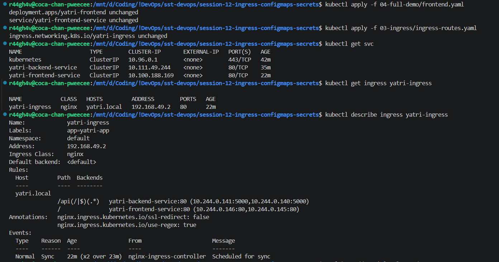

Both paths answered:

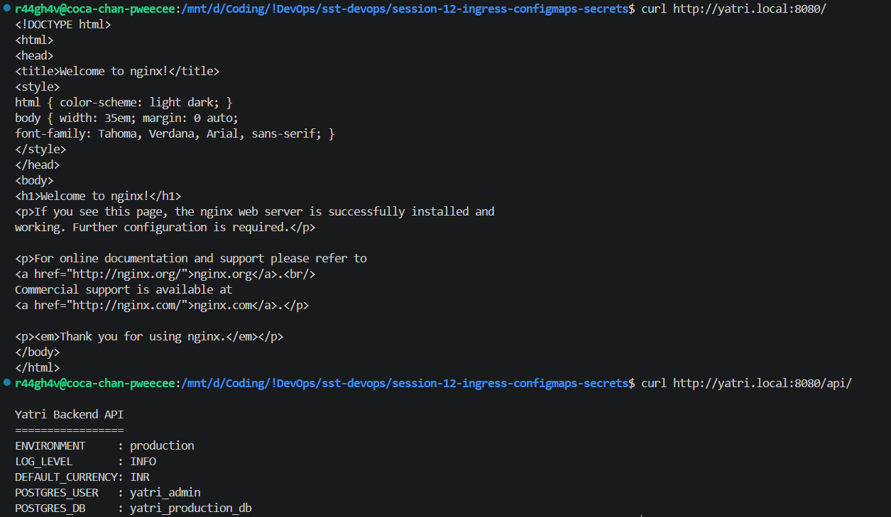

Host-based with TLS - two hostnames on the same IP, self-signed cert:

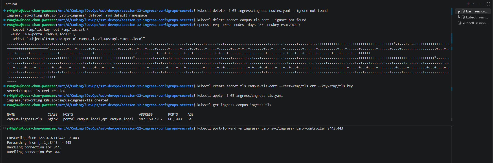

Both hosts answered over HTTPS:

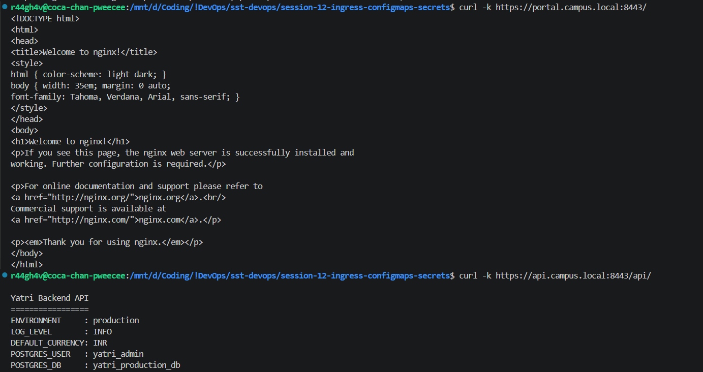

## 6. Full End-to-End Demo

`run-demo.sh` builds ConfigMap, Secret, frontend, backend and ingress in one go:

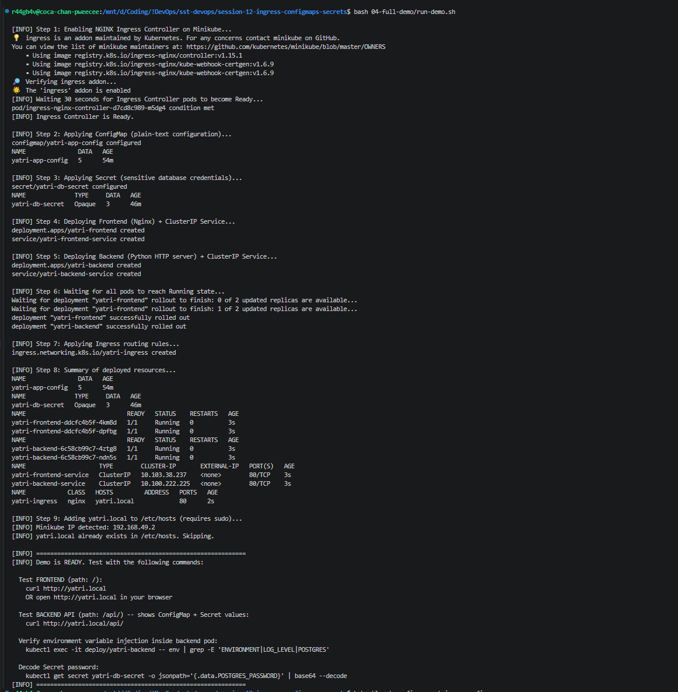

All resources created:

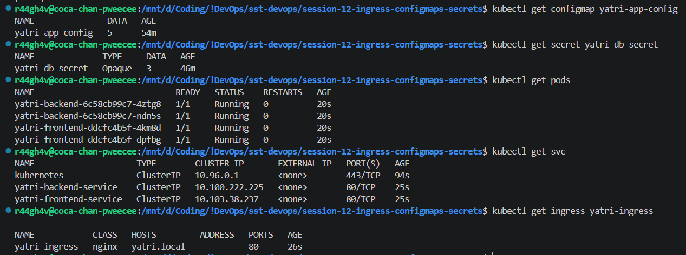

Frontend on `/` and backend on `/api` through the ingress:

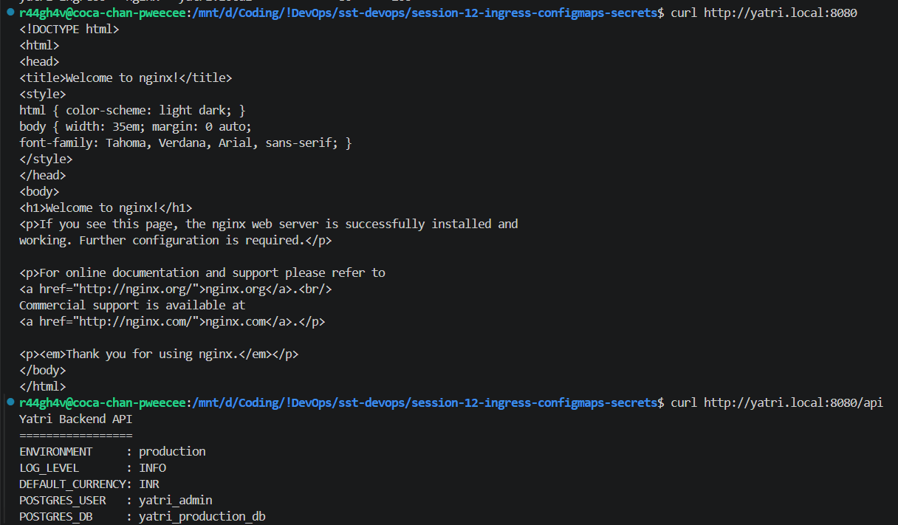

## 7. Ingress vs Ingress Controller

**Ingress** is a Kubernetes object where you write the **rules** - `/` goes to the frontend service, `/api` goes to the backend service. It is only a rule.

**Ingress Controller** is a controller, like the replicaset controller or node controller, that reads those rules and actually does the routing. It works as a reverse proxy for frontend and backend. The common ones are the NGINX Ingress Controller and HAProxy.


Two types of routing, both can be written in one ingress file:
- **Path-based** - one domain, different paths (`yatri.local/` and `yatri.local/api`).
- **Host-based** - different domains (`portal.campus.local`, `api.campus.local`).

## 8. Secrets

ConfigMap stores non-sensitive variables. Secret stores sensitive data that cannot be exposed to users or even to all developers. The `type` is always mentioned - `Opaque` for generic data, `kubernetes.io/tls` for certificates.

### Ways to add a secret

```bash
kubectl create secret generic db-secret --from-literal=USER=admin
kubectl create secret generic db-secret --from-file=./password.txt
kubectl create secret tls campus-tls-cert --cert=tls.crt --key=tls.key
kubectl apply -f secret.yaml        # values base64 encoded by hand
```

Encode with `echo -n`, not `echo` - plain `echo` adds a newline and the password is then wrong.

### In industry

The value is never written in the file. It is kept in AWS Secrets Manager, Azure Key Vault, HashiCorp Vault, or ADO variables and libraries, and the YAML or the CI/CD pipeline refers to it by **name** only. ADO variables are the cheapest - free - and once a value is saved there you cannot read it back, only overwrite it.

### Rotation

The vault can generate a new password every month, update the stored value automatically, and the application keeps using the same secret name. Same for TLS certificates, which expire every few months.
