# Assignment 13 - Kubernetes Storage, HPA & Probes

## 1. emptyDir

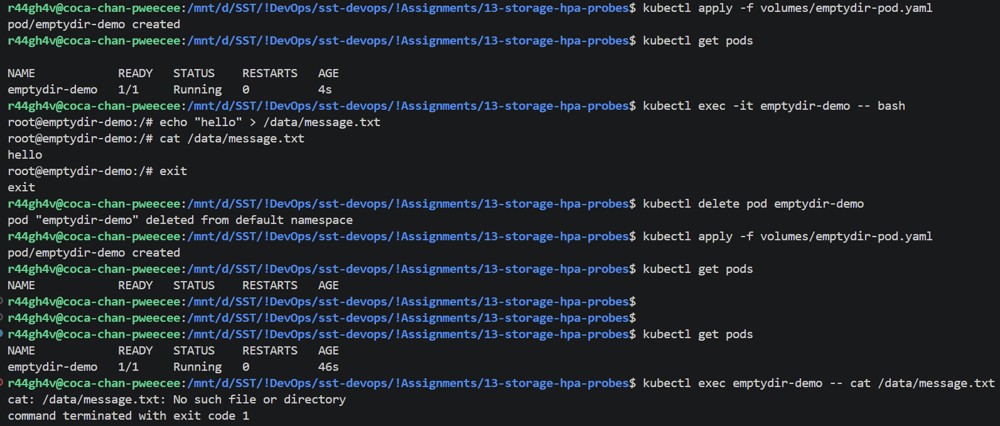

## 2. hostPath

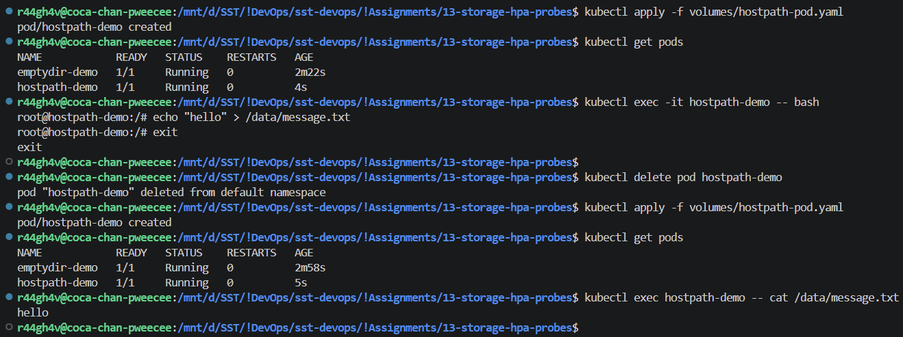

## 3. PersistentVolume & PersistentVolumeClaim

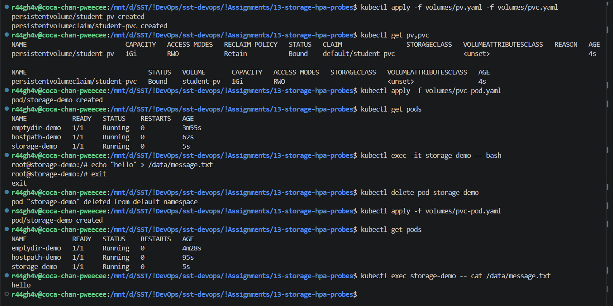

## 4. StorageClass & Dynamic Provisioning

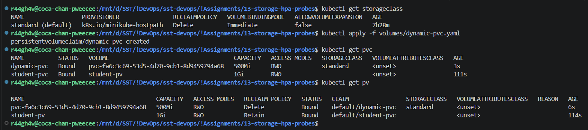

## 5. HPA - Deploy & Verify

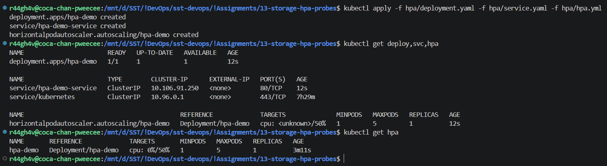

## 6. HPA - Load Generator, CPU & Pod Scaling

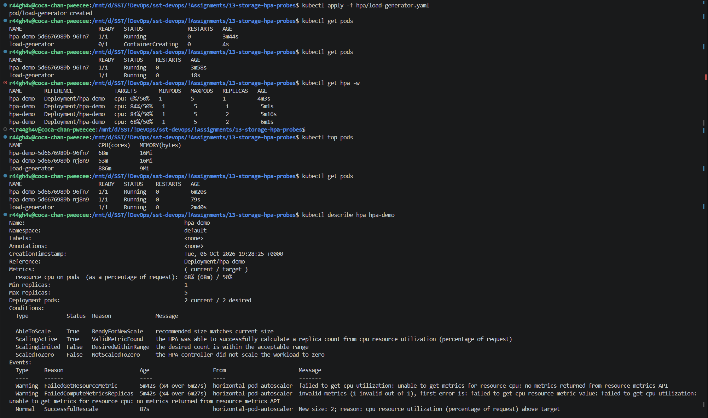

## 7. HPA - Scale Down

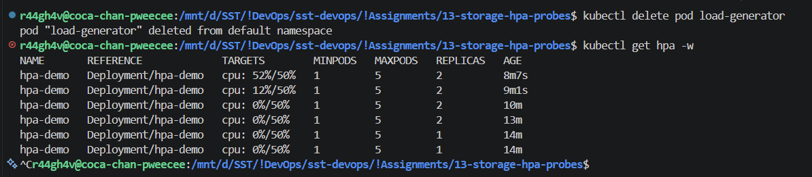

## 8. Mini Project - Storage, Probes & HPA

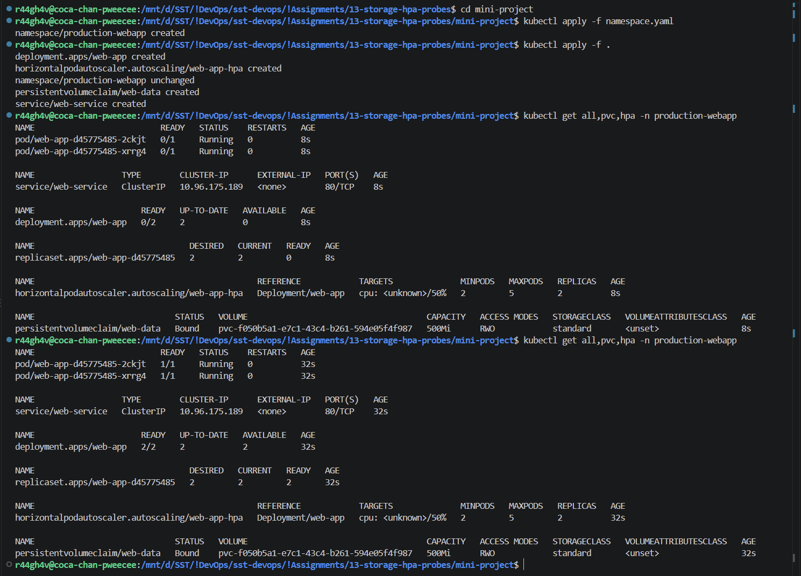
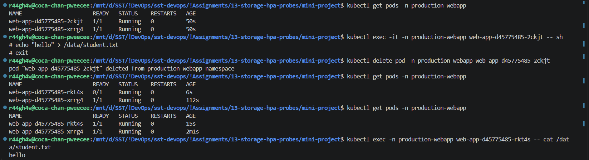
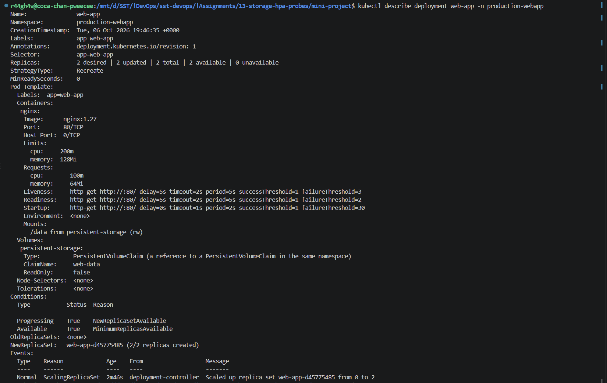
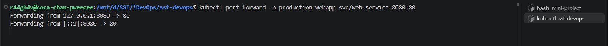
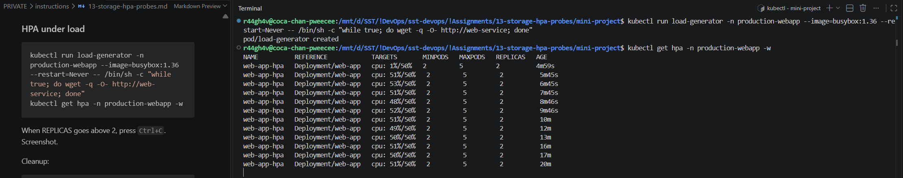
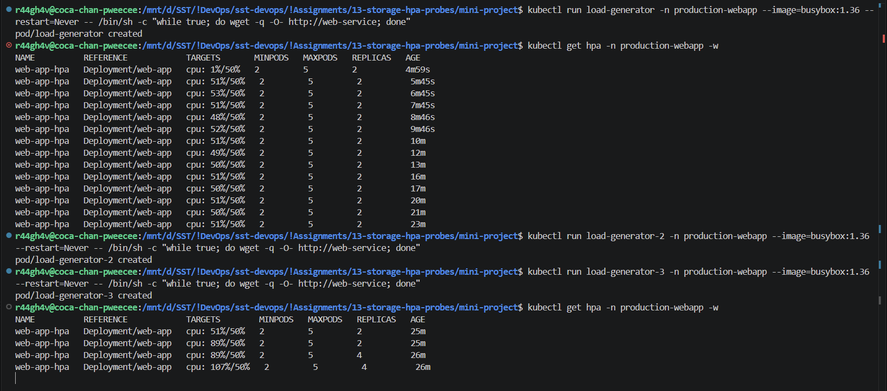

## 9. Kubernetes Volumes

Data inside a container is lost when the container restarts. A volume gives the pod a place to keep data.

| Volume | Lives as long as | What it is |
| :-- | :-- | :-- |
| emptyDir | The pod | Empty folder created with the pod, shared by its containers. Deleted with the pod. |
| hostPath | The node | Folder of the node mounted into the pod. Tied to one node, security risk - fine only for Minikube / node agents. |
| PersistentVolume (PV) | Independent of the pod | A piece of storage in the cluster (cluster-wide). |
| PersistentVolumeClaim (PVC) | Independent of the pod | A pod's request for storage; Kubernetes binds it to a PV. The pod mounts the PVC, never the PV directly. |
| StorageClass | - | Type of storage plus the provisioner that creates it (`standard` on Minikube, `gp3` on AWS). |

```yaml
volumes:
  - name: app-storage
    emptyDir: {}
  - name: host-storage
    hostPath:
      path: /tmp/hostpath-data
      type: DirectoryOrCreate
  - name: persistent-storage
    persistentVolumeClaim:
      claimName: student-pvc
```

**Dynamic provisioning:** with a StorageClass nobody creates the PV by hand. The PVC names the class (`storageClassName: standard`), the provisioner creates a PV and binds it automatically.

| Static | Dynamic |
| :-- | :-- |
| Admin creates the PV | Provisioner creates the PV |
| No StorageClass needed | StorageClass needed |

## 10. HPA

HPA (Horizontal Pod Autoscaler) changes the number of pod replicas automatically based on CPU usage. It needs Metrics Server and `resources.requests.cpu` on the Deployment, because utilization is measured against the request. Scale-down waits ~5 minutes so replicas do not flap.

```yaml
apiVersion: autoscaling/v2
kind: HorizontalPodAutoscaler
metadata:
  name: hpa-demo
spec:
  scaleTargetRef:
    apiVersion: apps/v1
    kind: Deployment
    name: hpa-demo
  minReplicas: 1
  maxReplicas: 5
  metrics:
    - type: Resource
      resource:
        name: cpu
        target:
          type: Utilization
          averageUtilization: 50
```

Files: [hpa/](hpa/) - `deployment.yaml`, `service.yaml`, `hpa.yml`, `load-generator.yaml` (busybox pod calling the service in a loop).

## 11. Probes

| Probe | Question | On failure |
| :-- | :-- | :-- |
| Startup | Has the app started? | Container restarted |
| Readiness | Can it take traffic? | Removed from Service endpoints, not restarted |
| Liveness | Is it still healthy? | Container restarted |
