# Assignment 15 - Helm

## 1. helm create

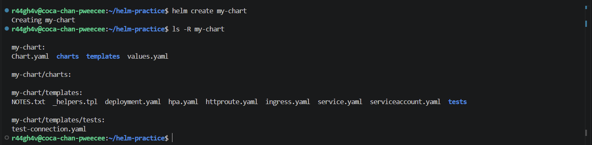

## 2. helm install, list, status

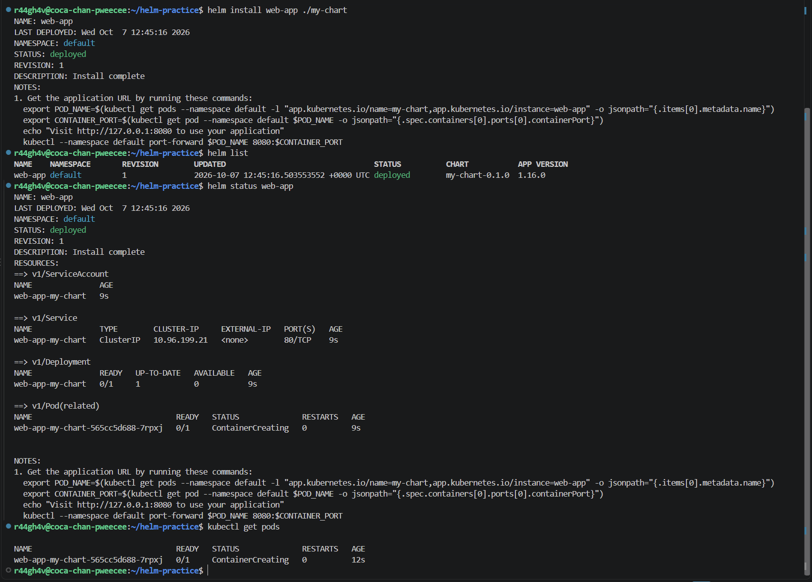

## 3. helm get

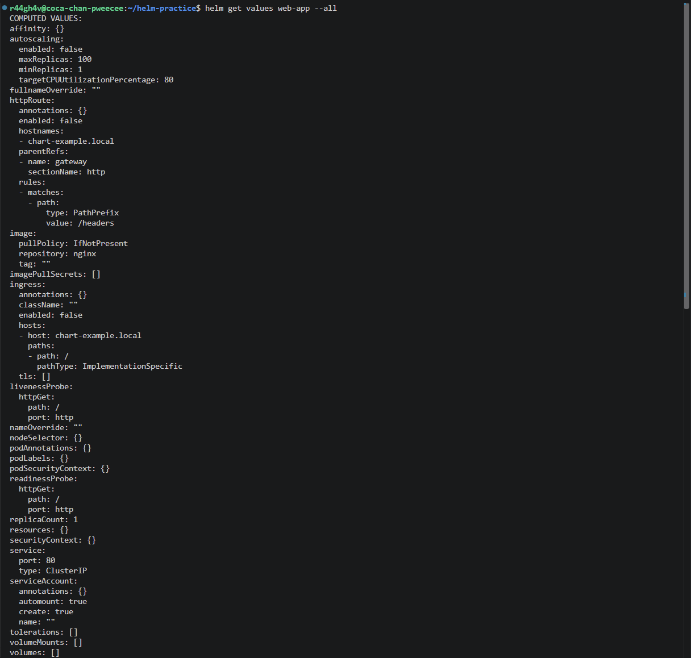
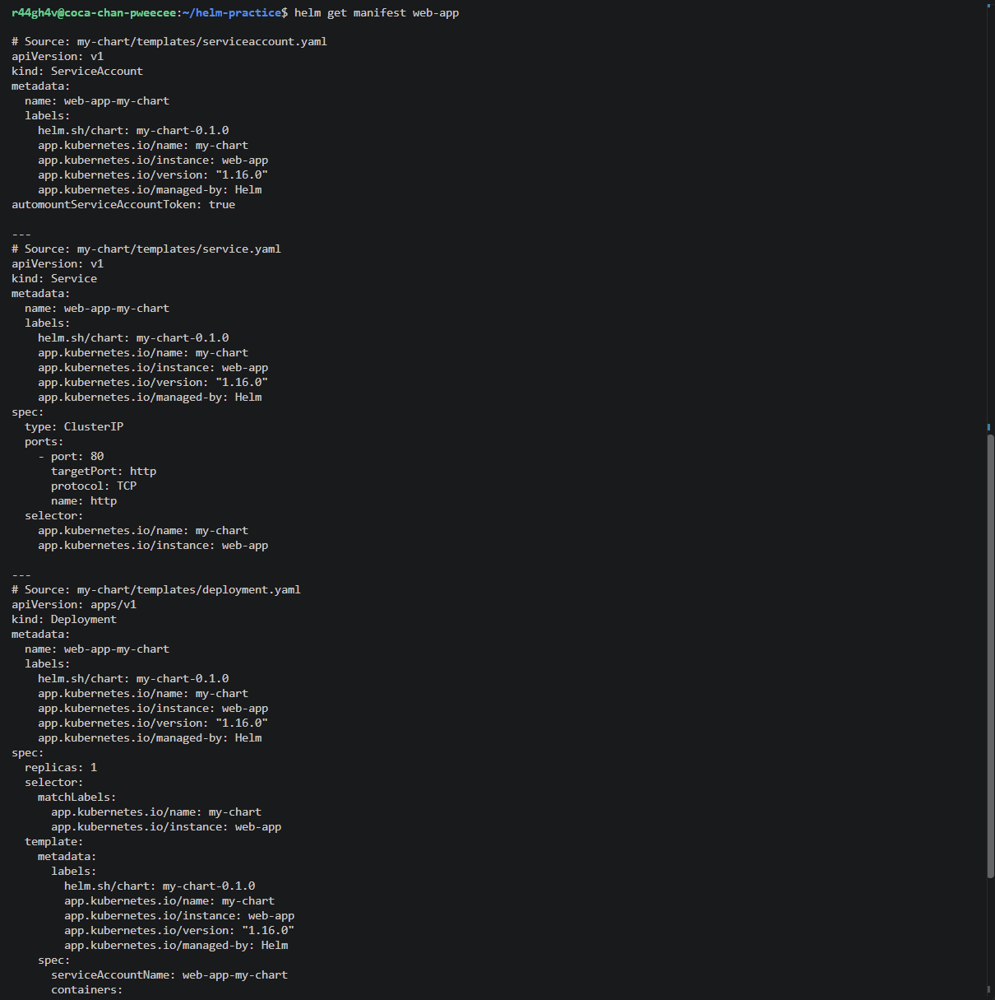

## 4. helm upgrade & history

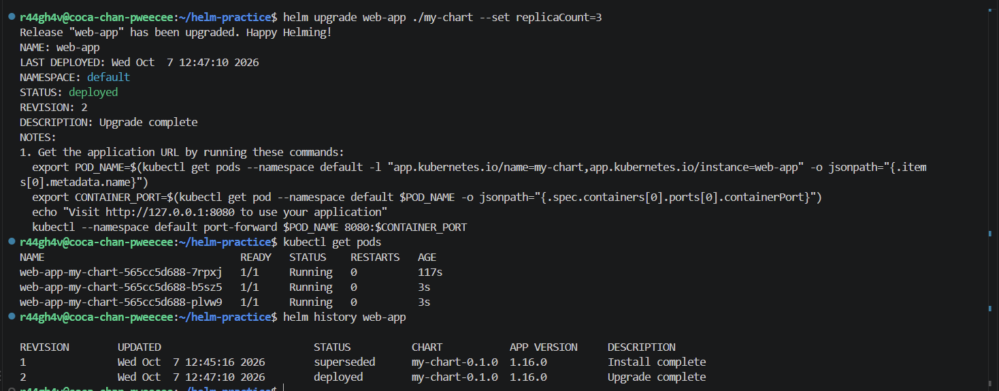

## 5. helm rollback

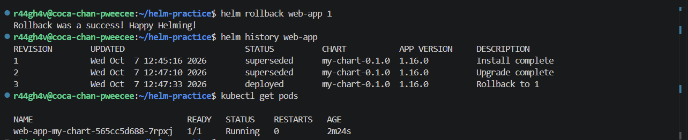

## 6. helm repo & search

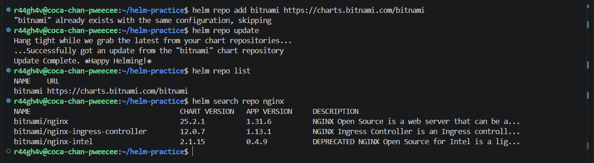

## 7. helm uninstall

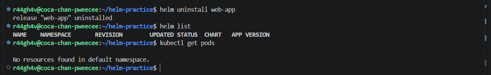

## 8. Rollback Workflow

Install → Upgrade → Verify → Upgrade again → Verify → Rollback → Verify

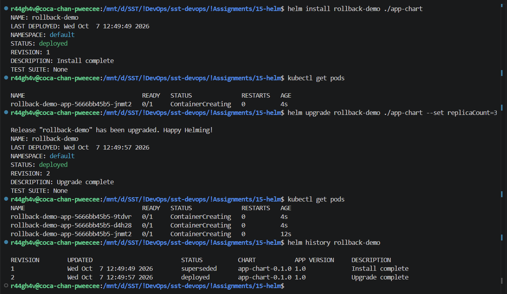
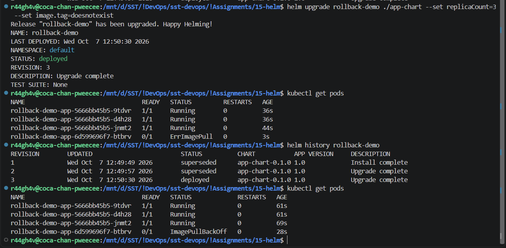
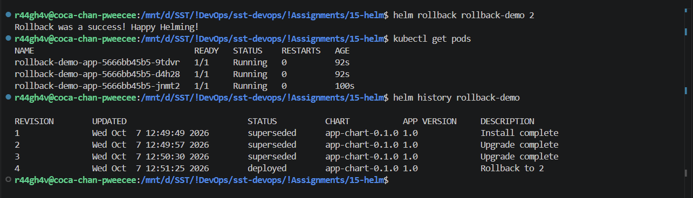

## 9. Mini Project - Notes App Chart

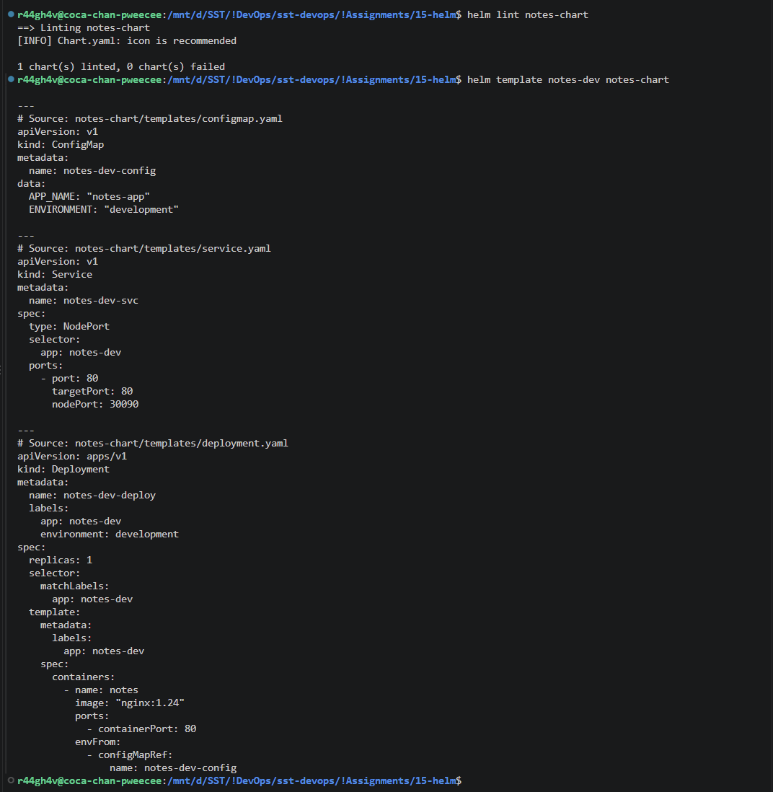
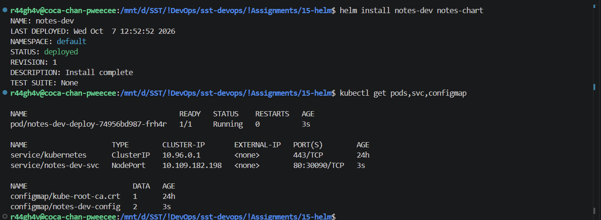
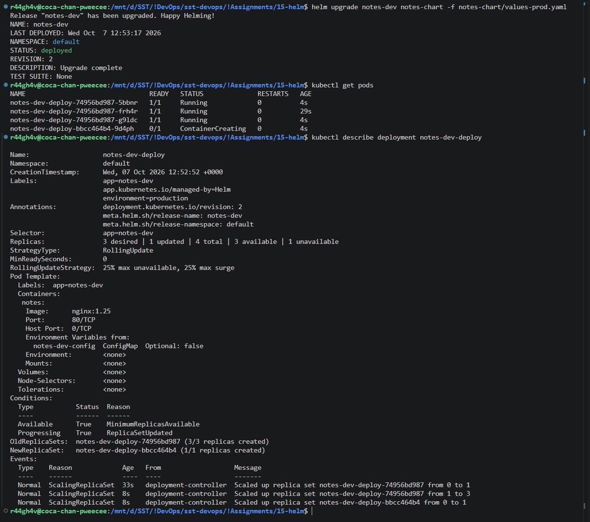
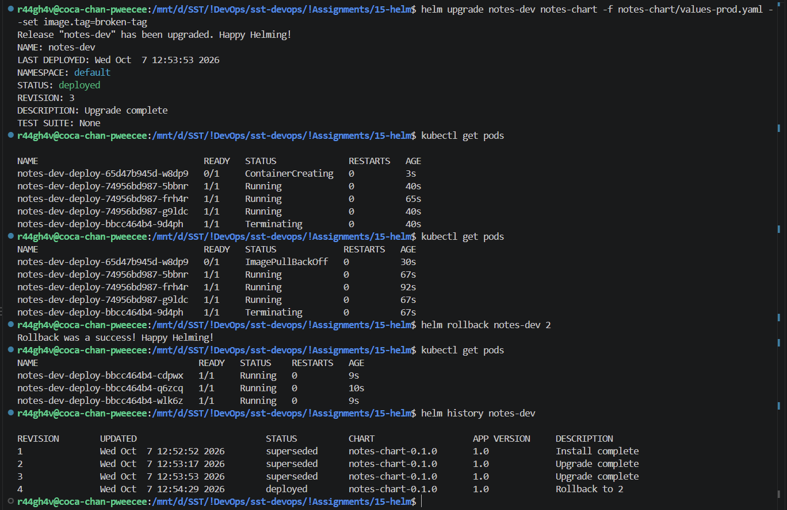
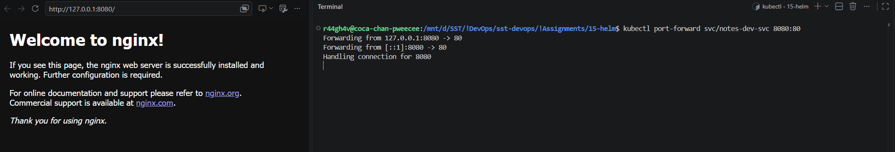

## 10. Helm Commands

| Command | What it does |
| :-- | :-- |
| `helm create` | Generates a starter chart |
| `helm install <release> <chart>` | Deploys a chart as a release (revision 1) |
| `helm list` | Lists releases |
| `helm status` | State of a release |
| `helm get values / manifest` | Values used / YAML applied |
| `helm upgrade` | Applies a change, new revision |
| `helm history` | All revisions of a release |
| `helm rollback <release> <rev>` | Goes back to a revision (creates a new revision) |
| `helm uninstall` | Deletes the release |
| `helm repo add / update / list` | Manages chart repositories |
| `helm search repo <word>` | Searches charts in added repos |

## 11. Rollback Workflow

| Revision | Action | Result |
| :-- | :-- | :-- |
| 1 | `helm install` | 1 pod, nginx:1.24 |
| 2 | `helm upgrade --set replicaCount=3` | 3 pods |
| 3 | `helm upgrade --set image.tag=doesnotexist` | new pod `ImagePullBackOff` |
| 4 | `helm rollback <release> 2` | healthy again |

## 12. Mini Project Chart

[notes-chart/](notes-chart/) - `Chart.yaml`, `values.yaml` (dev: 1 replica, nginx:1.24), `values-prod.yaml` (3 replicas, nginx:1.25), templates for Deployment, Service (NodePort 30090) and ConfigMap.
