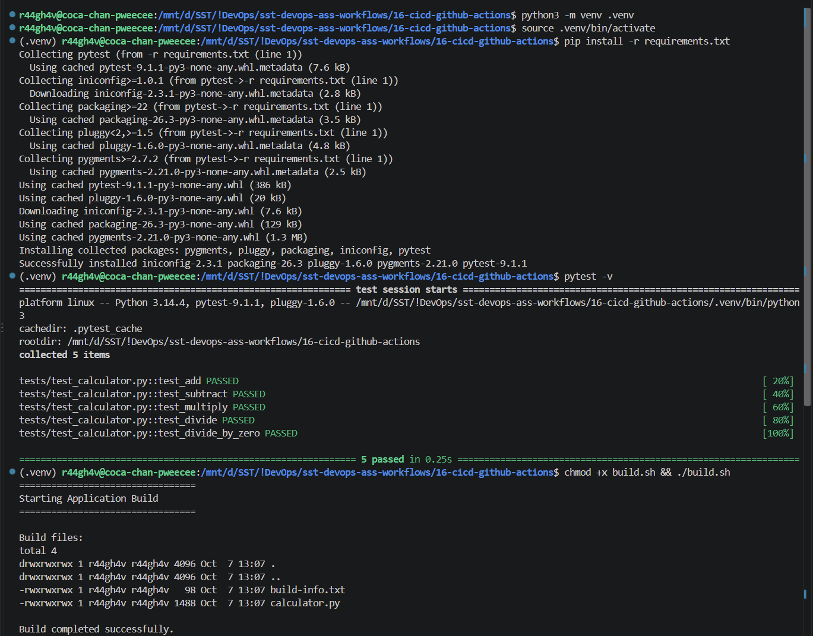
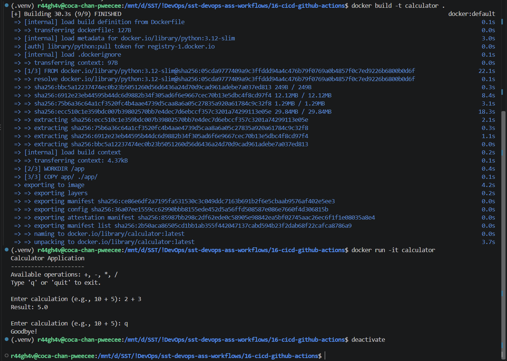
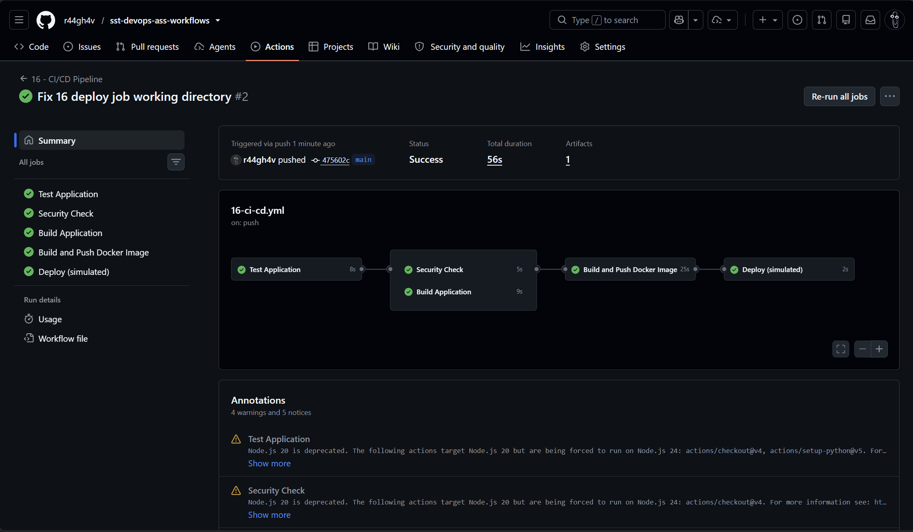
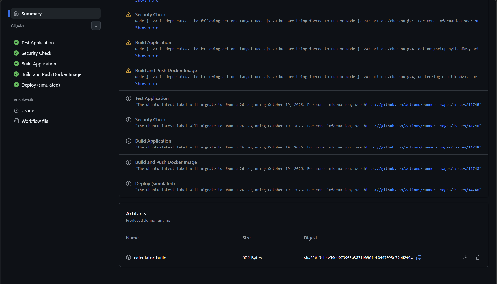
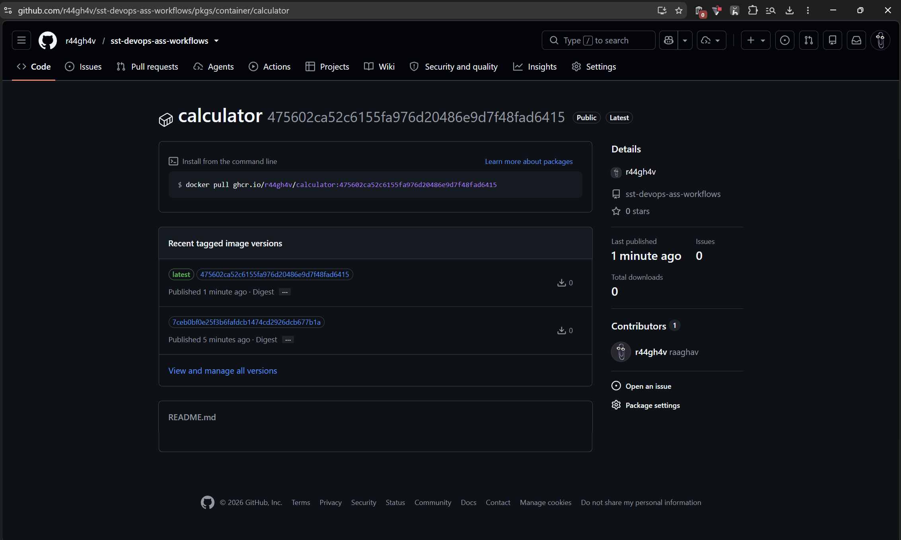
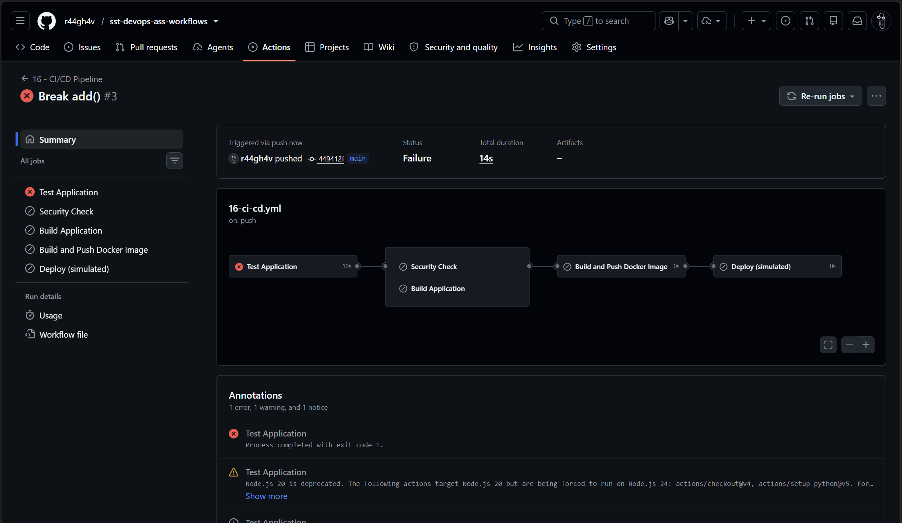
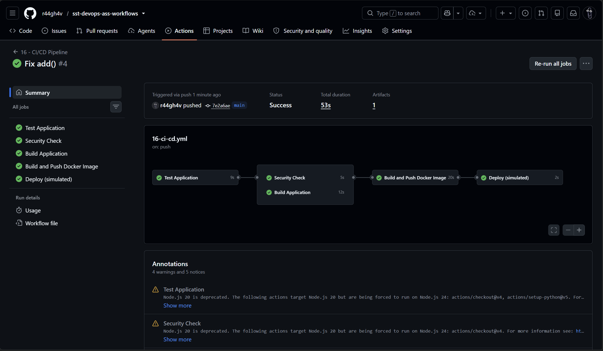

# Assignment 16 - CI/CD & GitHub Actions

## 1. Local Build & Test




## 2. Pipeline Execution



## 3. Artifact



## 4. Docker Image in Container Registry



## 5. Failing Test Stops the Pipeline




## 6. CI vs CD

| CI - Continuous Integration | CD - Continuous Delivery / Deployment |
| :-- | :-- |
| Build and test every push / pull request | Release the tested build |
| Catches bugs early | Delivers it automatically (or after one approval) |

## 7. CI/CD Pipeline

Project: calculator app (`app/`, `tests/`), `Dockerfile`, `build.sh`, workflow [.github/workflows/ci-cd.yml](.github/workflows/ci-cd.yml).

```text
test ─┬─ security-check ─┐
      └─ build ──────────┴─ docker-publish (main only) → deploy
└────── CI ──────┘          └──────────── CD ──────────┘
```

If `test` fails nothing after it runs. CD (push image to GHCR, deploy) runs only on `main`.

## 8. GitHub Actions

| Term | Meaning | Here |
| :-- | :-- | :-- |
| Workflow | YAML file in `.github/workflows/` | `ci-cd.yml` |
| Job | Group of steps on one runner; `needs` sets the order | `test`, `security-check`, `build`, `docker-publish`, `deploy` |
| Step | One command (`run`) or action (`uses`) | checkout, setup-python, `pytest -v` |
| Runner | Machine that runs the job | `ubuntu-latest` |
| Secret | Encrypted value, used as `${{ secrets.NAME }}` | `GITHUB_TOKEN` for pushing the image |
| Artifact | File kept after the job ends | `calculator-build` (the `build/` folder) |
