# Assignment 17 - Complete CI/CD & DevSecOps

## 1. Unit Tests

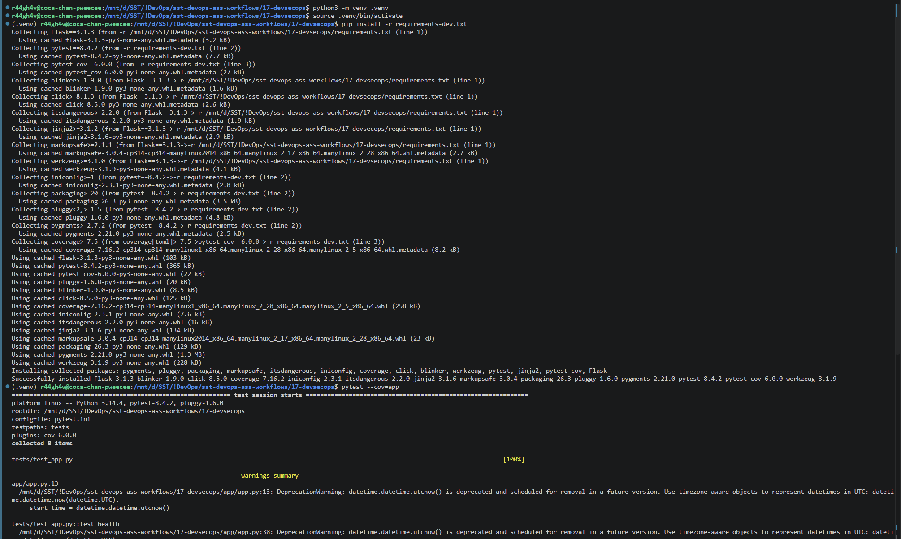
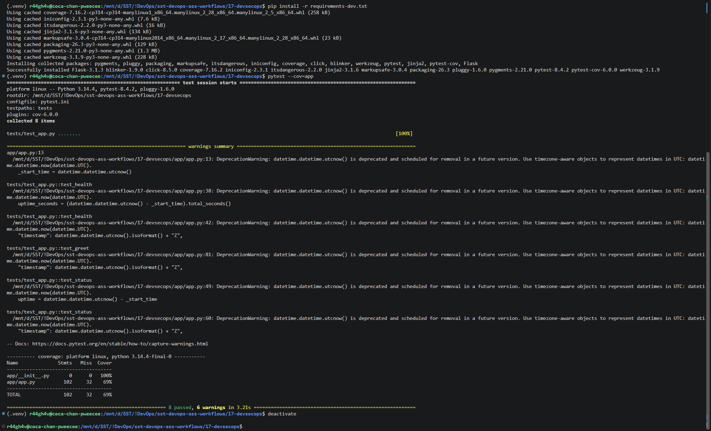

## 2. Pipeline Execution

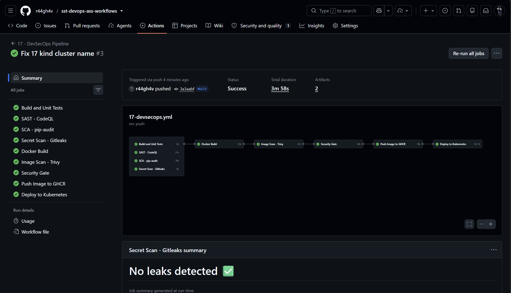

## 3. SAST - CodeQL

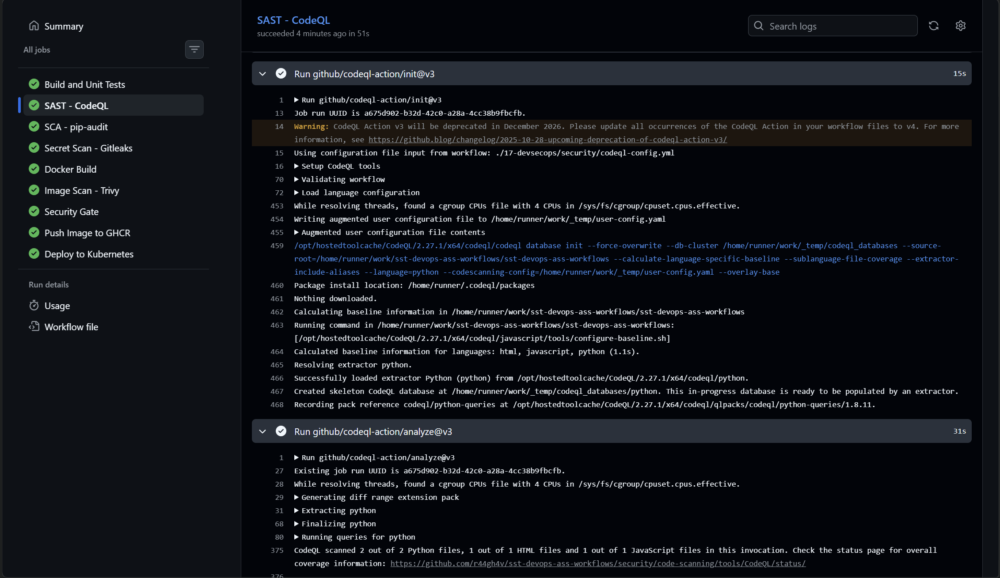
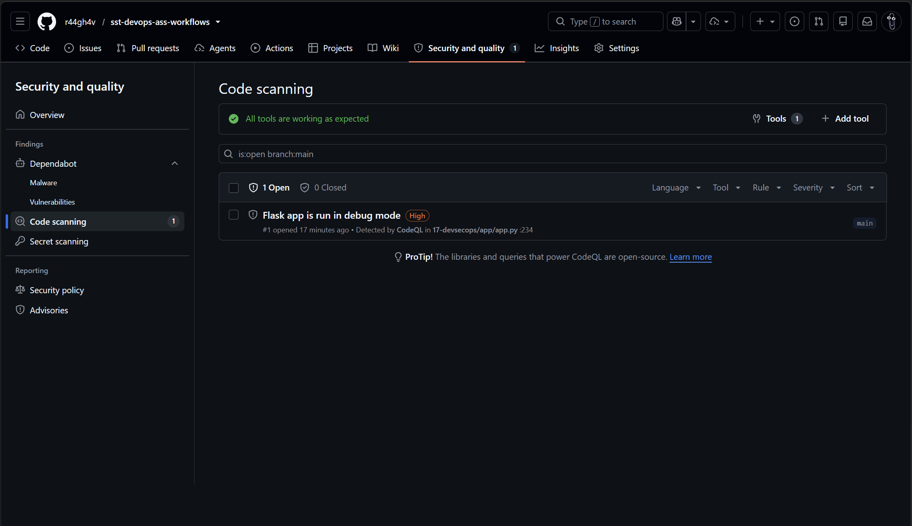

## 4. SCA - pip-audit

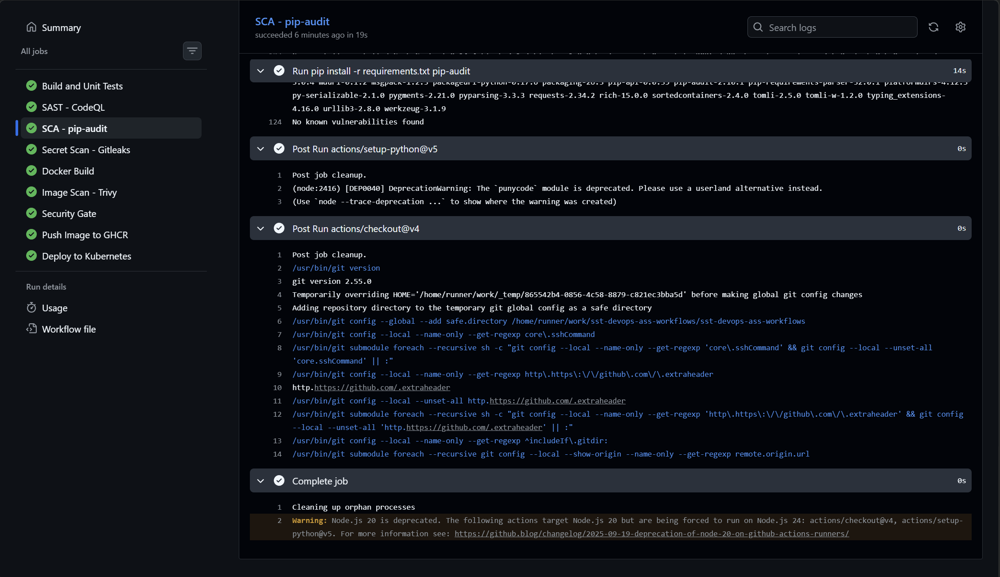

## 5. Secret Scanning - Gitleaks

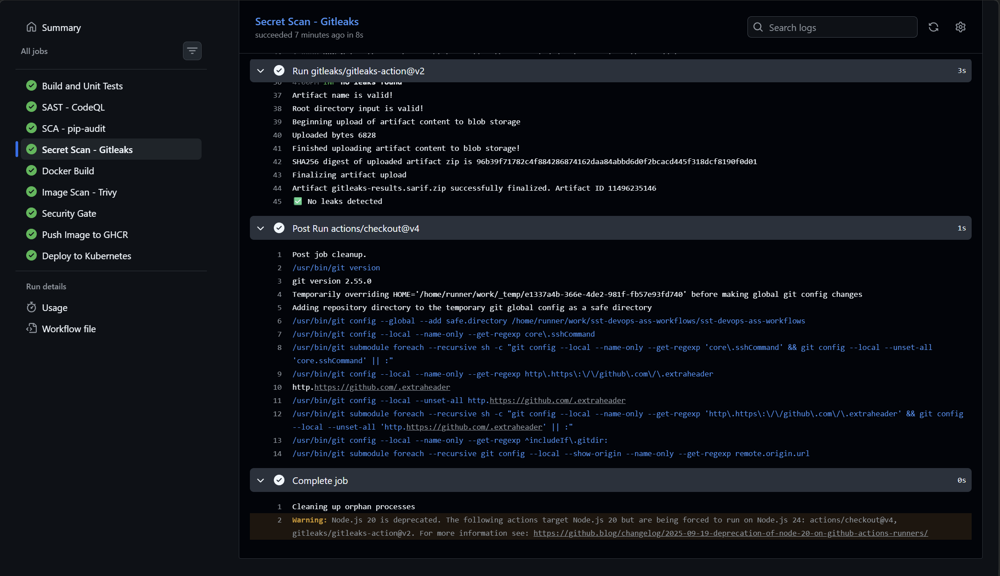

## 6. Container Image Scanning - Trivy

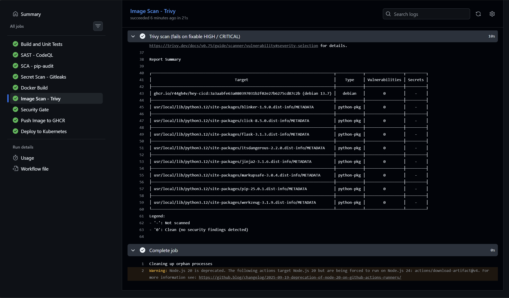

## 7. Security Gate Stopping the Pipeline

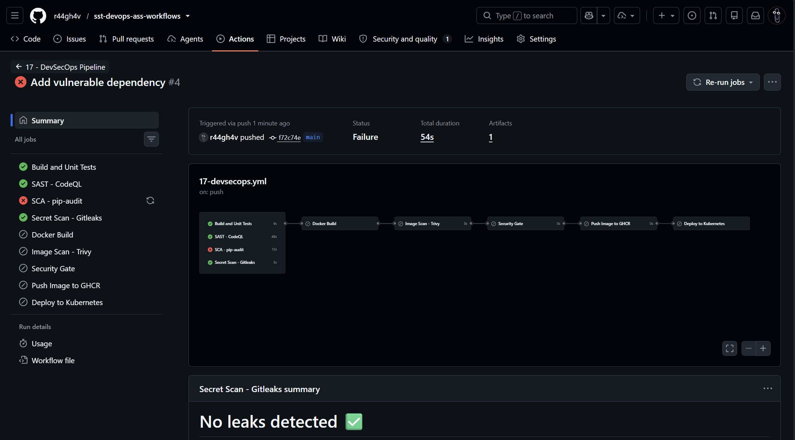
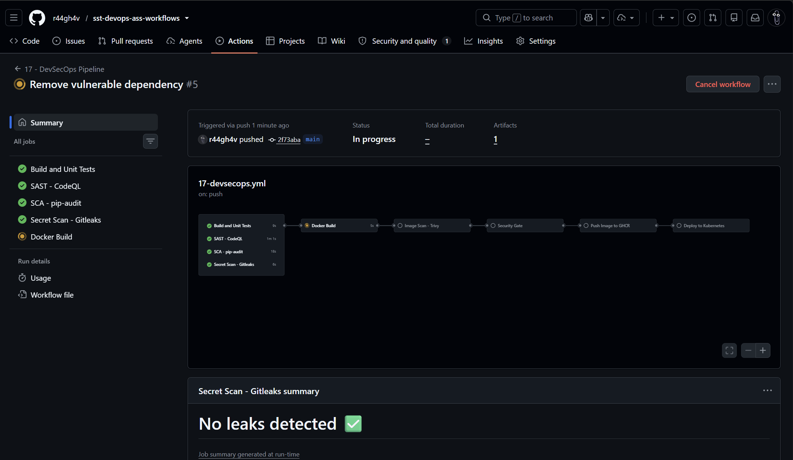

## 8. Image in Container Registry

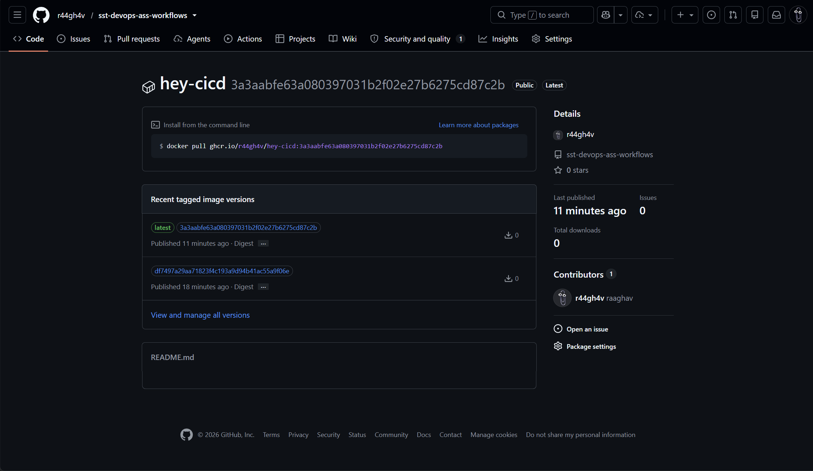

## 9. Kubernetes Deployment

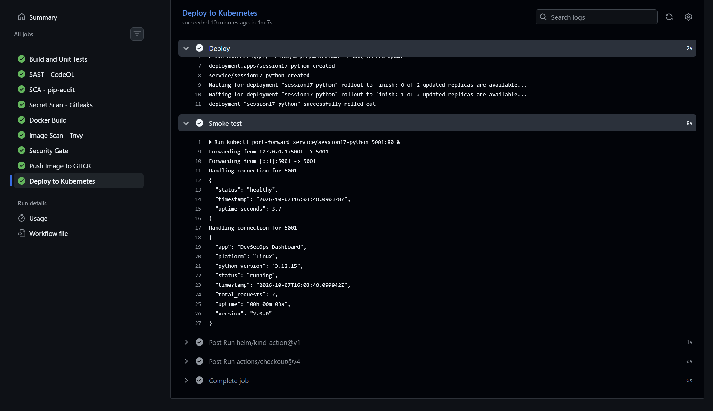

## 10. Pipeline Flow

Project: Flask app (`app/`, `tests/`), `Dockerfile`, `k8s/`, `security/gitleaks.toml`, workflow [.github/workflows/devsecops.yml](.github/workflows/devsecops.yml).

```text
Code → Build → Unit Test → SAST → SCA → Secret Scan → Docker Build
     → Container Image Scan → Security Gate → Push Image → Deploy to Kubernetes
```

## 11. Security Checks

| Check | Looks at | Tool |
| :-- | :-- | :-- |
| SAST | Our source code | GitHub CodeQL |
| SCA | Third-party dependencies (known CVEs) | pip-audit |
| Secret scanning | Passwords / keys committed to the repo and its history | Gitleaks |
| Container image scanning | OS packages and libraries inside the image | Trivy (`--severity HIGH,CRITICAL --exit-code 1`) |

## 12. Security Gate

A scan only finds a problem; a gate decides what happens. Every tool exits non-zero on findings, and the `needs:` chain (`docker-build` → `image-scan` → `security-gate` → `push` → `deploy`) means a failed check stops the pipeline before the image is pushed or deployed.

## 13. Registry & Kubernetes

Image goes to GitHub Container Registry as `ghcr.io/<owner>/hey-cicd:<commit-sha>` using `GITHUB_TOKEN`. `k8s/deployment.yaml` (2 replicas) and `k8s/service.yaml` (NodePort) are deployed to a temporary kind cluster in the runner, then `/health` is checked with curl.
