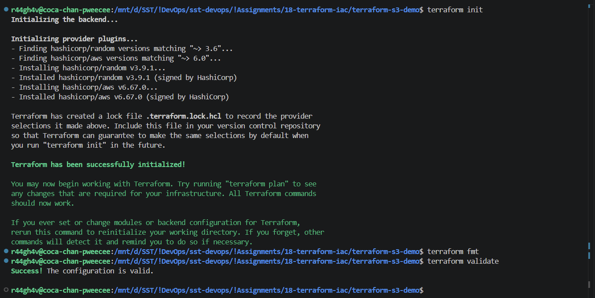
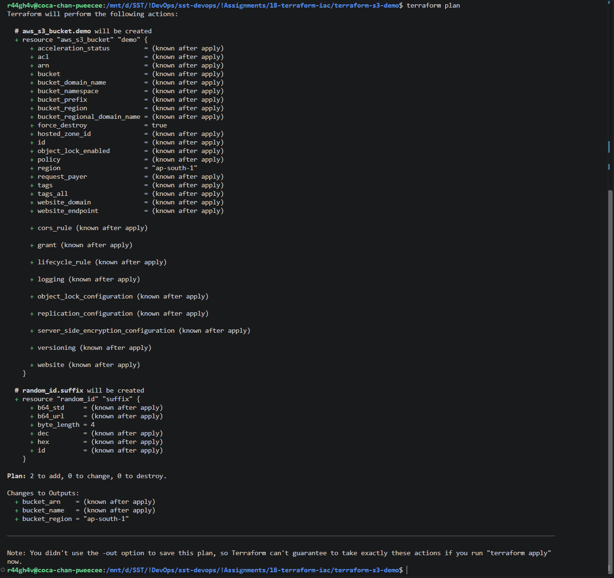
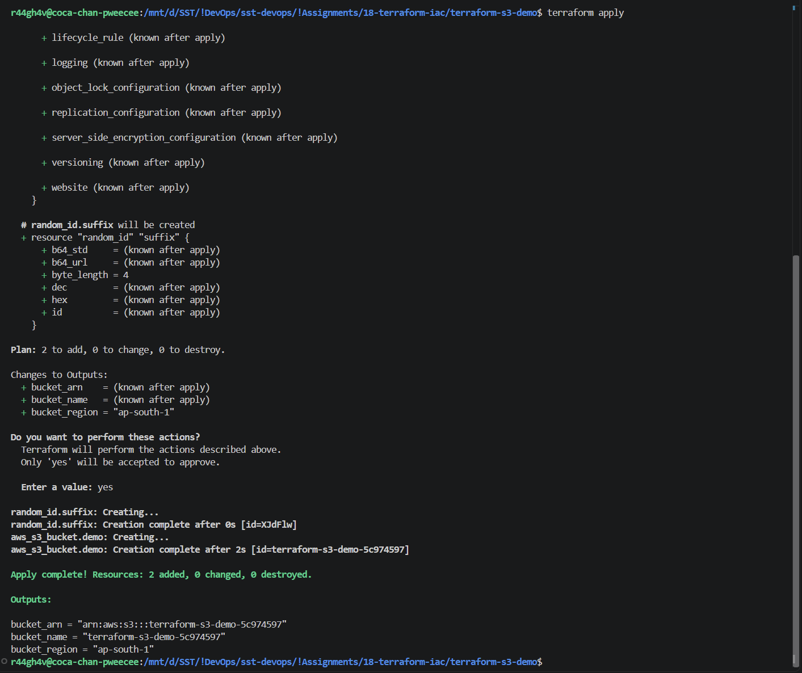
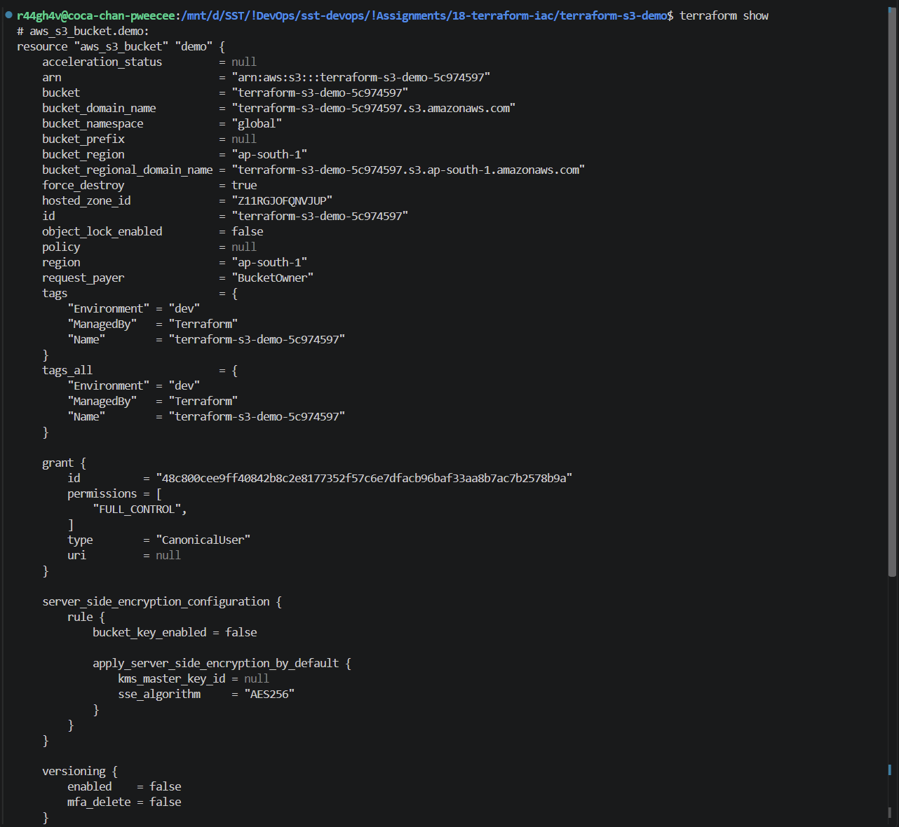
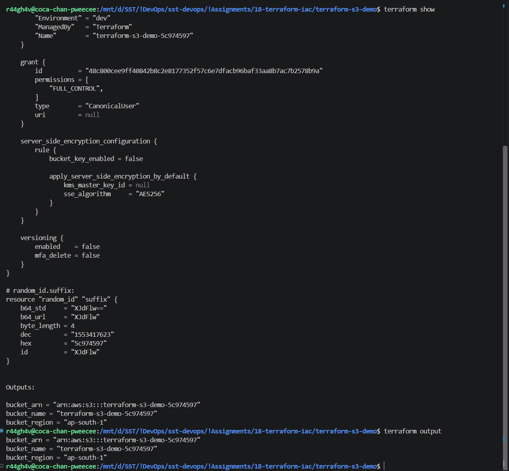
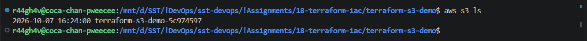
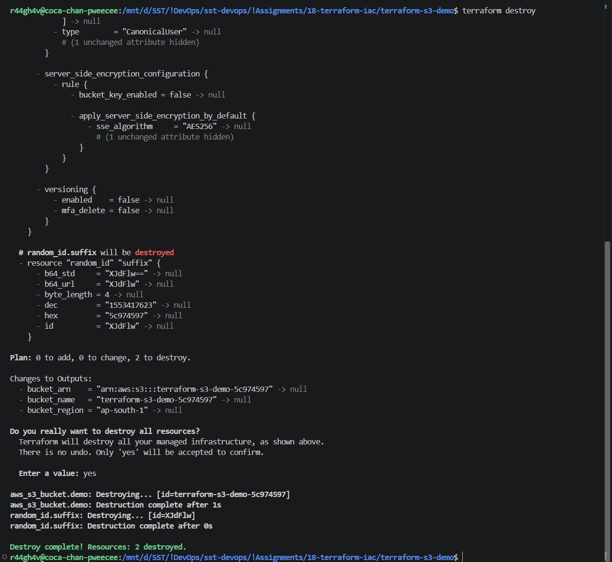

# Assignment 18 - Terraform & Infrastructure as Code

## 1. terraform init, fmt, validate

## 2. terraform plan

## 3. terraform apply

## 4. terraform show & output

## 5. S3 Bucket in AWS

## 6. terraform destroy

## 7. Terraform S3 Demo

Files in [terraform-s3-demo/](terraform-s3-demo/):

| File | Purpose |
| :-- | :-- |
| provider.tf | Terraform version, AWS + random providers, region |
| variables.tf | Inputs: region, bucket prefix, environment |
| terraform.tfvars | Values for the inputs |
| main.tf | S3 bucket (random suffix - bucket names are globally unique) |
| outputs.tf | Bucket name, ARN, region |

| Command | What it does |
| :-- | :-- |
| `terraform init` | Downloads the providers |
| `terraform fmt` | Formats the code |
| `terraform validate` | Checks syntax |
| `terraform plan` | Shows what will be created |
| `terraform apply` | Creates it (type `yes`) |
| `terraform show` | Shows the state |
| `terraform output` | Prints the outputs |
| `terraform destroy` | Deletes everything |

`terraform.tfstate` is Terraform's record of what it created - kept out of Git.

## 8. AWS Services

### 01. IAM - Governance

IAM (Identity and Access Management) controls **who** can do **what** on which AWS resource. Global, free.

| Term | Meaning |
| :-- | :-- |
| User | One person or app with long-term credentials |
| Group | Collection of users sharing the same policies |
| Role | Identity assumed temporarily (EC2, Lambda, another account) - no long-term keys |
| Policy | JSON document listing allowed / denied actions on resources |
| Permissions | What the attached policies allow; everything is denied by default, an explicit deny always wins |

Least privilege: give only the permissions needed, nothing more.
Best practices: don't use the root account, enable MFA, use roles instead of access keys, give permissions through groups, rotate keys.
Use cases: developer access, EC2 reading from S3 via a role, CI/CD pipeline deploying to AWS.

### 02. EC2 - Compute

EC2 (Elastic Compute Cloud) gives virtual servers in the cloud.

| Term | Meaning |
| :-- | :-- |
| AMI | Image the instance boots from (Ubuntu, Amazon Linux) |
| Instance type | CPU / memory size, e.g. `t2.micro`, `t3.medium` |
| Key pair | SSH key to log in |
| Security group | Instance-level firewall, stateful, allow rules only |
| EBS | Disk attached to the instance, survives stop |
| Public vs private IP | Public is reachable from the internet and changes on stop/start (unless Elastic IP); private is inside the VPC and stays |

Lifecycle: pending → running → stopping → stopped → terminated.
Use cases: web servers, app backends, build servers, Kubernetes nodes.

### 03. S3 - Storage

S3 (Simple Storage Service) is object storage, practically unlimited.

| Term | Meaning |
| :-- | :-- |
| Bucket | Container for objects, name unique across all of AWS |
| Object | A file plus its metadata, addressed by a key |
| Storage classes | Standard, Intelligent-Tiering, Standard-IA, One Zone-IA, Glacier - cheaper as access gets rarer |
| Versioning | Keeps every version of an object, protects against overwrite / delete |
| Lifecycle policies | Move objects to cheaper classes or delete them after N days |
| Encryption | Server-side by default (SSE-S3), or SSE-KMS |
| Bucket policy | JSON policy on the bucket deciding who can access it; public access is blocked by default |

Use cases: backups, static websites, logs, Terraform state, data lakes.

### 04. VPC - Networking

VPC (Virtual Private Cloud) is your own isolated network in AWS.

| Term | Meaning |
| :-- | :-- |
| CIDR | IP range of the VPC, e.g. `10.0.0.0/16` |
| Subnet | Part of the VPC range in one Availability Zone, e.g. `10.0.1.0/24` |
| Route table | Rules for where subnet traffic goes |
| Internet Gateway | Connects the VPC to the internet |
| NAT Gateway | Lets private subnets reach the internet outbound only |
| Security group | Instance-level firewall, stateful |
| Network ACL | Subnet-level firewall, stateless, allow and deny rules |

Public subnet: route `0.0.0.0/0 → Internet Gateway` (web servers, load balancers).
Private subnet: no direct route from the internet, outbound via NAT (databases, backends).

### 05. DynamoDB & RDS - Databases

**DynamoDB** - managed NoSQL key-value database, serverless, scales automatically.

| Term | Meaning |
| :-- | :-- |
| Table | Collection of items |
| Item | One record (like a row) |
| Attribute | One field of an item; items can have different attributes |
| Partition key | Main key, decides where the item is stored |
| Sort key | Optional second key, orders items with the same partition key |

Use cases: sessions, carts, gaming leaderboards, IoT data - high traffic with simple access patterns.

**RDS** - managed relational (SQL) database.

| Term | Meaning |
| :-- | :-- |
| Engines | MySQL, PostgreSQL, MariaDB, Oracle, SQL Server, Aurora |
| DB instance | The database server, with an instance class and storage |
| Security | Private subnet, security groups, encryption at rest (KMS), IAM auth |
| Backups | Automated daily backups with point-in-time restore, plus manual snapshots |
| Multi-AZ | Standby copy in another AZ, automatic failover - for availability |
| Read replicas | Read-only copies - for read performance |

Use cases: e-commerce orders, banking, ERP - structured data with relations and transactions.
