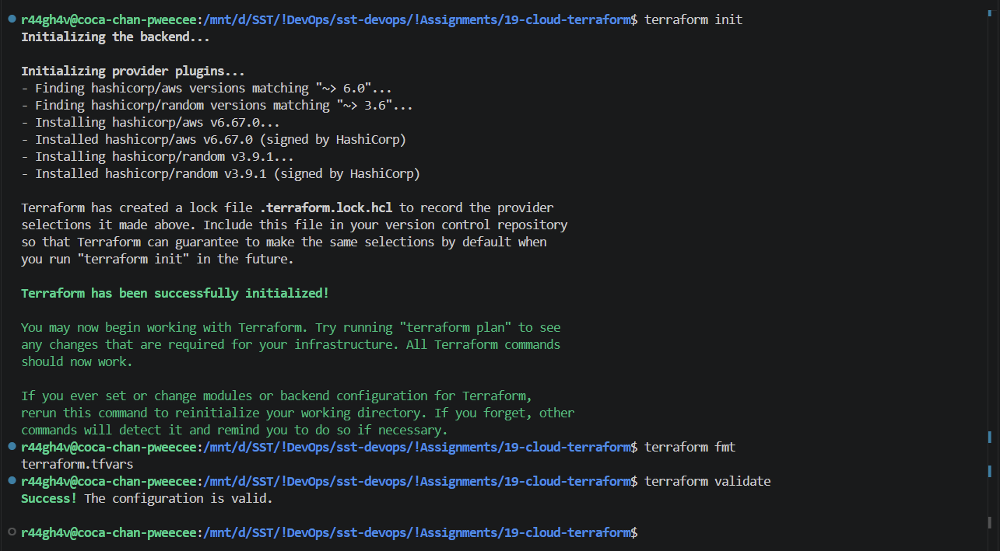
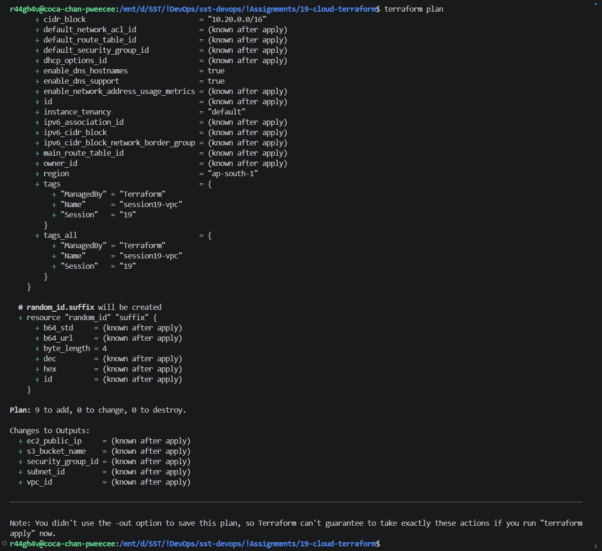
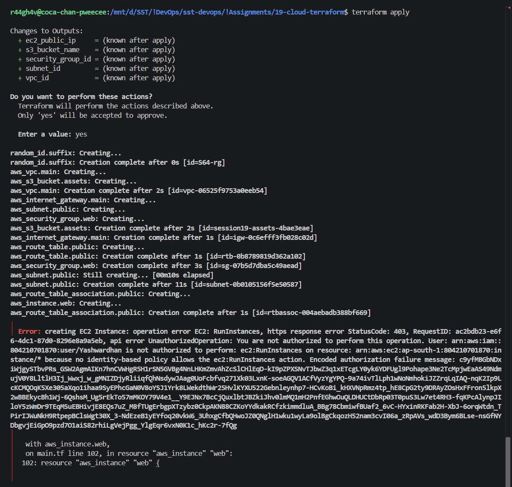
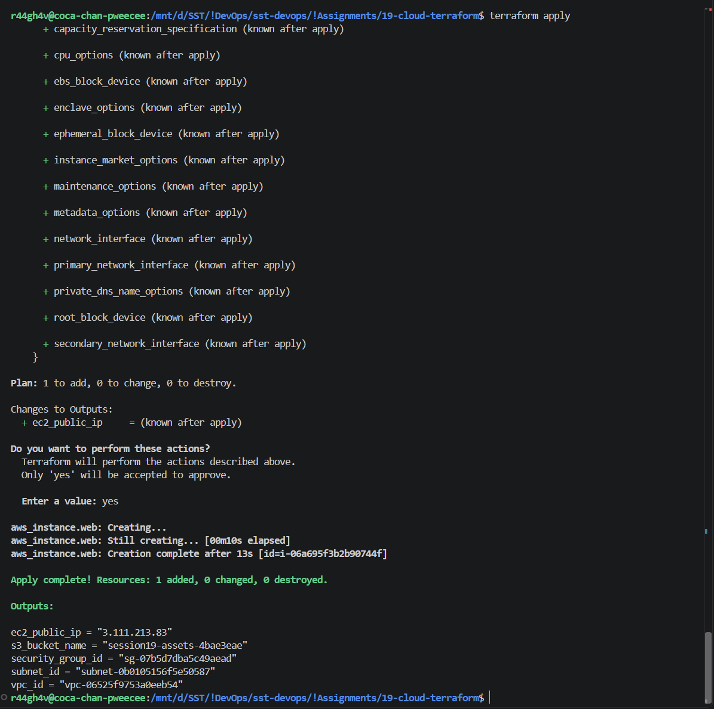
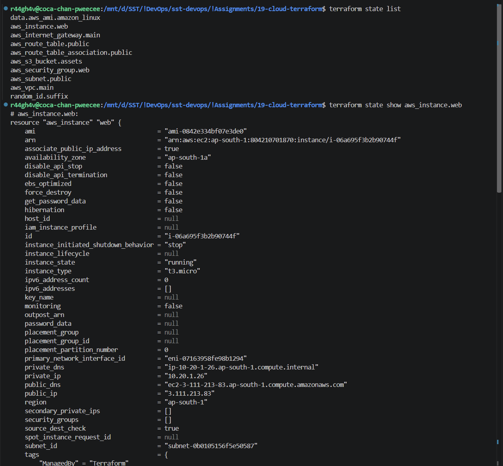
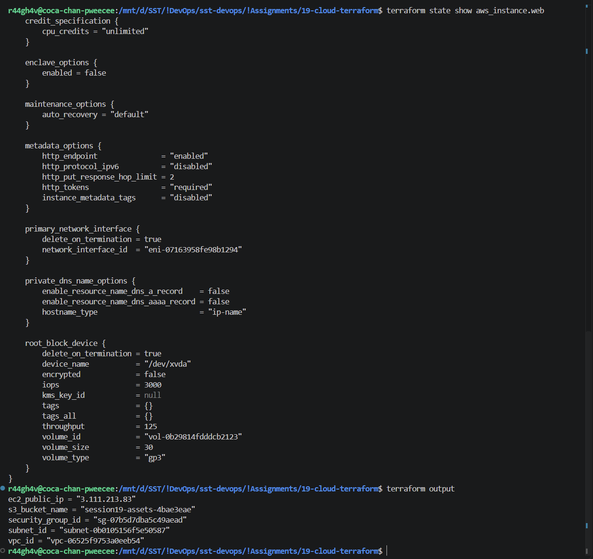
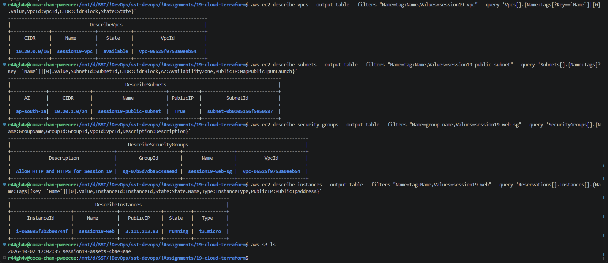
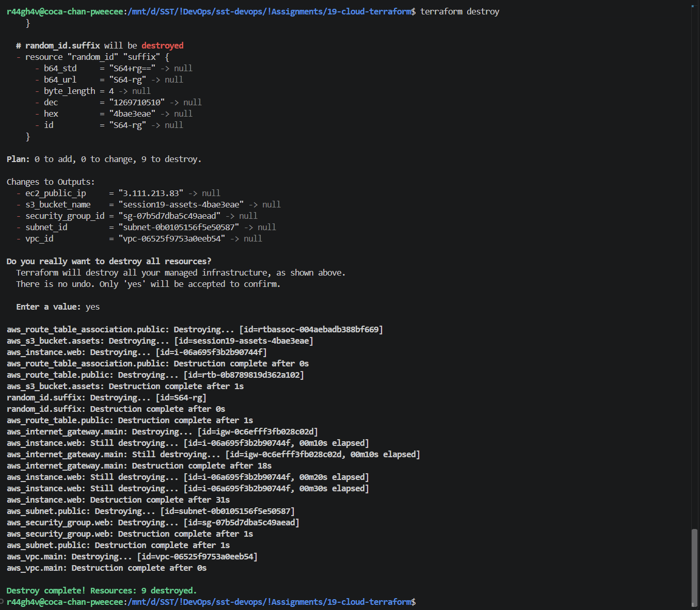

# Assignment 19 - Cloud & Terraform in Action

## 1. terraform init & validate



## 2. terraform plan



## 3. terraform apply




## 4. Terraform State & Outputs




## 5. AWS Resources



## 6. terraform destroy



## 7. Architecture

```text
Terraform
|
├── VPC 10.20.0.0/16
|   ├── Internet Gateway
|   ├── Route table (0.0.0.0/0 → IGW)
|   └── Public Subnet 10.20.1.0/24
|         └── EC2 ← Security Group (80, 443)
|
└── S3 bucket
```

## 8. Terraform Project

| File | Contains |
| :-- | :-- |
| versions.tf | Providers (aws, random) and region |
| variables.tf | Variables `aws_region`, `instance_type` |
| terraform.tfvars.example | Example values - copy to `terraform.tfvars` |
| main.tf | Resources: VPC, subnet, IGW, route table, security group, EC2, S3 |
| outputs.tf | Outputs: VPC id, subnet id, SG id, EC2 public IP, bucket name |

**Dependencies:** the subnet uses `aws_vpc.main.id`, the EC2 uses the subnet and security group ids, so Terraform creates VPC → subnet / IGW / SG → route table → EC2 in that order, and destroys in reverse.

**State:** `terraform.tfstate` records every created resource and its id, so the next `plan` knows what already exists. Kept out of Git.

| Command | What it does |
| :-- | :-- |
| `terraform init` | Downloads the providers |
| `terraform validate` | Checks syntax |
| `terraform plan` | Shows what will be created |
| `terraform apply` | Creates the resources |
| `terraform state list` | Lists resources in the state |
| `terraform output` | Prints the outputs |
| `terraform destroy` | Deletes everything |
