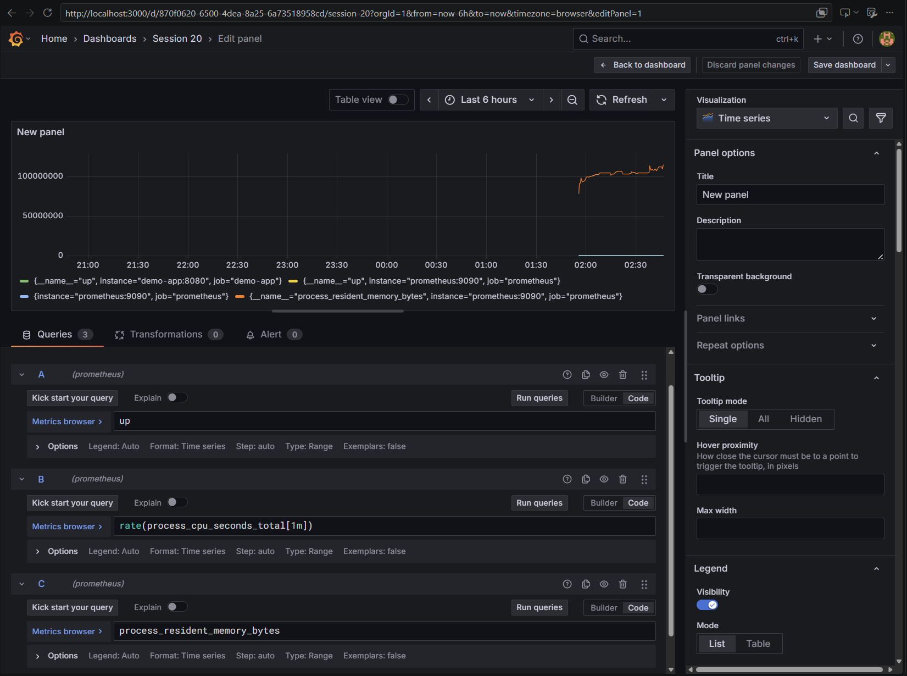
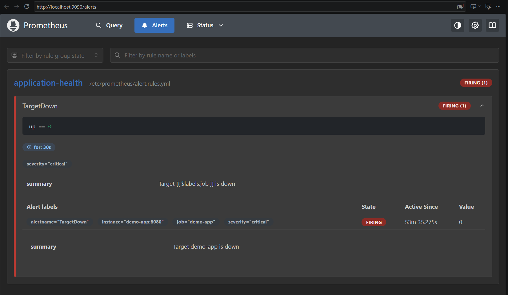
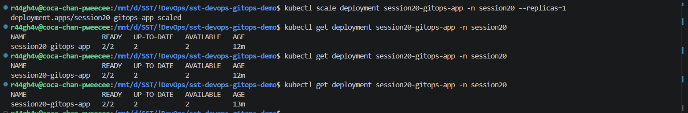

# Assignment 20 - Monitoring, Observability & GitOps

## 1. Prometheus - Metrics & Application Health


## 2. Grafana - CPU & Memory Utilization



## 3. Alerts



## 4. Logs


## 5. GitOps - Argo CD Application Synced


## 6. GitOps - Change in Git Synced to the Cluster


## 7. GitOps - Manual Change Reverted (Self-Heal)



## 8. Monitoring

Monitoring = collecting known numbers and alerting when they cross a limit. Demo: Prometheus (collects metrics) + Grafana (dashboards) running in Docker, and a small Kubernetes workload for logs. Files: [monitoring/](monitoring/).

| Item | What | In this demo |
| :-- | :-- | :-- |
| Metrics | Numbers over time | Prometheus scrapes targets every 5s; query `up`, `process_resident_memory_bytes` |
| Logs | Text events from the app | `kubectl logs deployment/session20-demo` |
| Alerts | Notification when a rule is broken | Rule `TargetDown` (`up == 0`) fires for the `demo-app` target that is down on purpose |
| CPU utilization | CPU used | `rate(process_cpu_seconds_total[1m])` panel in Grafana |
| Memory utilization | RAM used | `process_resident_memory_bytes` panel in Grafana |
| Application health | Is the target up | `up` metric (1 = up, 0 = down) |

## 9. Observability

Monitoring tells **that** something is wrong; observability lets you find **why**, from the data the system produces.

| Pillar | Meaning | Answers | Tools |
| :-- | :-- | :-- | :-- |
| Metrics | Numeric values over time | Is something wrong? How much? | Prometheus, CloudWatch |
| Logs | Timestamped event records | What exactly happened? | Loki, ELK, Fluentd |
| Traces | Path of one request through all services | Where is it slow / failing? | Jaeger, Tempo, OpenTelemetry |

**Why required:** in microservices one request crosses many services and pods that come and go - without all three it is guesswork to find which one failed.

**Common tools:** Prometheus, Grafana, Loki, ELK (Elasticsearch, Logstash, Kibana), Jaeger, OpenTelemetry, Datadog, CloudWatch.

**Kubernetes observability:** Metrics Server (`kubectl top`), kube-prometheus-stack (Prometheus + Grafana + Alertmanager via Helm), `kubectl logs` / Loki for logs, `kubectl get events`, probes for health, OpenTelemetry for traces.

## 10. GitOps

| Concept | Meaning |
| :-- | :-- |
| GitOps | Operating the cluster through Git: change Git, the cluster follows |
| Git as source of truth | The desired state of the cluster is whatever is in the repo - not what someone ran with `kubectl` |
| Declarative configuration | YAML describes the end state, not the steps |
| Continuous reconciliation | An agent keeps comparing the cluster with Git and fixes any difference (drift) |

Workflow:

```text
Developer → commit / PR to Git → merge → Argo CD detects change → syncs cluster → cluster = Git
```

Kubernetes + GitOps: Argo CD (or Flux) runs inside the cluster and **pulls** from Git, so the CI pipeline needs no cluster credentials. Rollback = `git revert`. Manual changes with `kubectl` are reverted automatically (self-heal).

Demo: the Argo CD Application in my fork [r44gh4v/sst-devops-gitops-demo](https://github.com/r44gh4v/sst-devops-gitops-demo) watches its `app/` folder (Deployment, Service). Changing `replicas` in Git and pushing changes the cluster; a manual `kubectl scale` is reverted (self-heal). Manifests are copied in [gitops/](gitops/).
