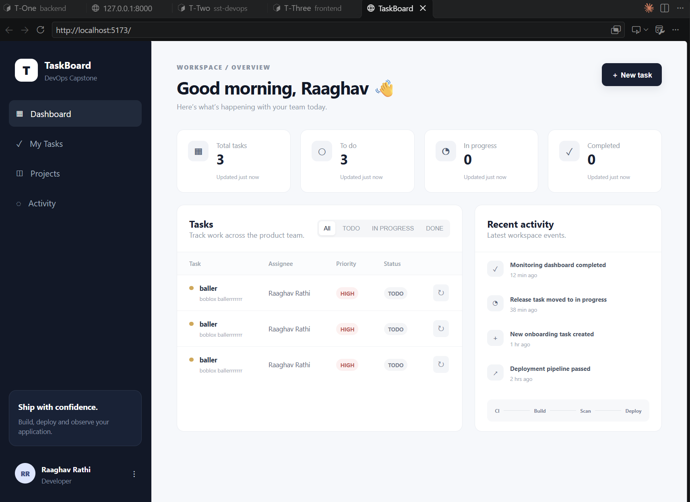
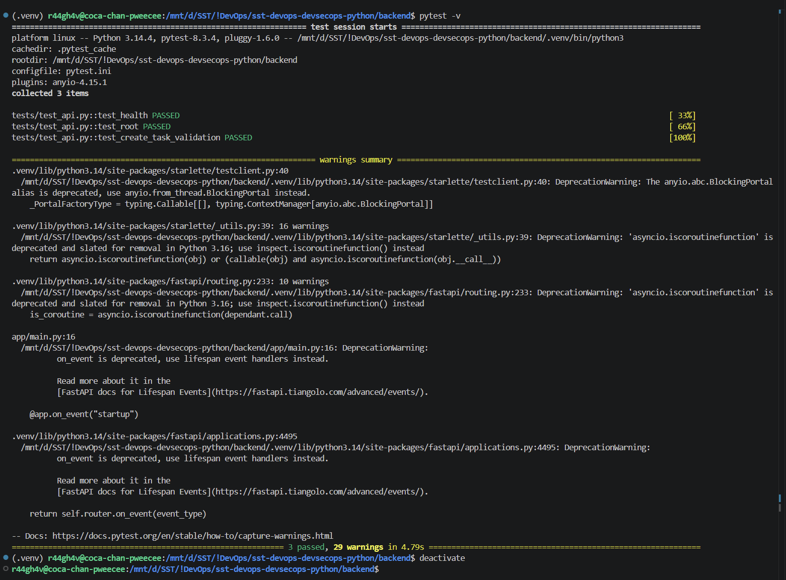
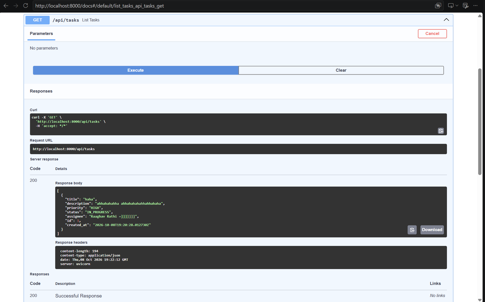
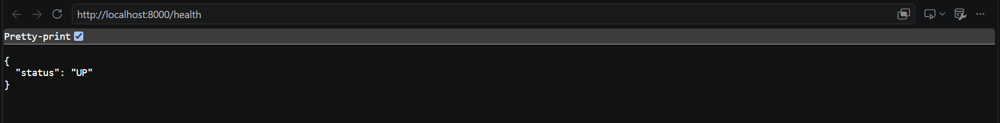
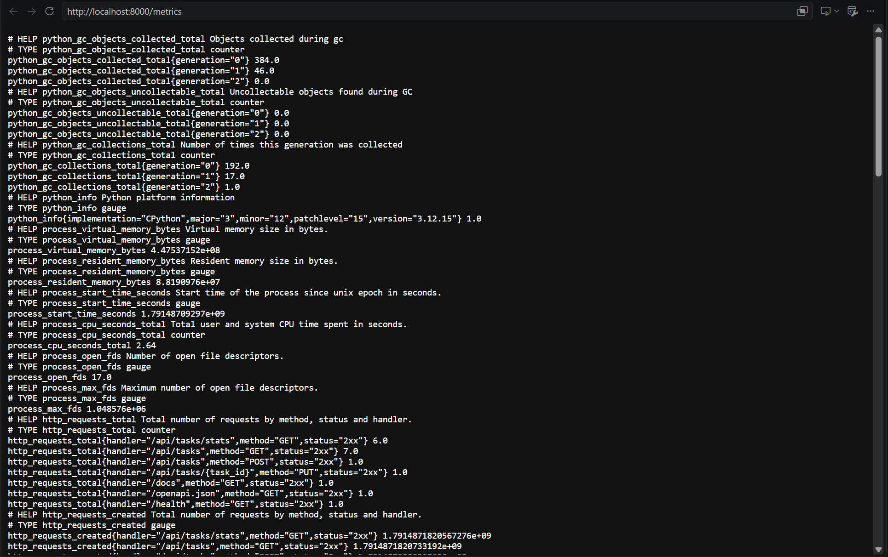

# Assignment 21 - Run the TaskBoard DevSecOps Project

Session 21 homework: run the class TaskBoard project end to end - manually, with Docker, with Docker Compose - test the application and its backend APIs, and run the CI/CD pipeline.

Project repo (fork of the class repo): [r44gh4v/sst-devops-devsecops-python](https://github.com/r44gh4v/sst-devops-devsecops-python)

## 1. Run Manually - Database & Backend


## 2. Run Manually - Frontend



## 3. Backend Tests (pytest)



## 4. Docker - Build & Run Images


## 5. Docker Compose


## 6. Application UI


## 7. Backend API - /docs



## 8. Backend API - /health



## 9. Backend API - /metrics



## 10. CI/CD Pipeline


## 11. Project Overview

TaskBoard is a three-tier task management app: a React (Vite) frontend served by nginx, a FastAPI backend, and a PostgreSQL database with Alembic migrations.

```text
Browser → Frontend (React + nginx :3000) → Backend (FastAPI :8000) → PostgreSQL (:5432)
                                                │
                                         /metrics → Prometheus
```

| Layer | Tech |
| :-- | :-- |
| Frontend | React, Vite, nginx |
| Backend | FastAPI, SQLAlchemy, Alembic, Pydantic |
| Database | PostgreSQL 16 (Docker volume for data) |
| Tests | pytest |
| Containers | Dockerfile per service, Docker Compose for all three |
| CI/CD | GitHub Actions: test → build → Trivy scan → push to Docker Hub → deploy to kind |
| Infra (files only) | Terraform (AWS VPC + EKS), Helm chart, Kubernetes manifests |
| Monitoring | Prometheus metrics at `/metrics` |

## 12. Backend Endpoints

| Endpoint | Purpose |
| :-- | :-- |
| `GET /health` | Liveness - process is up |
| `GET /ready` | Readiness - database reachable |
| `GET /metrics` | Prometheus metrics |
| `GET /docs` | Swagger UI to try every API |
| `GET /api/tasks`, `POST /api/tasks` | List / create tasks |
| `GET /api/tasks/{id}`, `PUT /api/tasks/{id}`, `DELETE /api/tasks/{id}` | Read / update / delete one task |
| `GET /api/tasks/stats` | Task counts by status |

## 13. CI/CD Pipeline

| Job | What it does |
| :-- | :-- |
| Test | Install backend deps, run `pytest`, build the frontend |
| Docker Build | Build backend and frontend images tagged with the commit SHA |
| Image Scan - Trivy | Scan both images for HIGH / CRITICAL vulnerabilities |
| Push | Log in to Docker Hub with the `DOCKERHUB_TOKEN` secret, push `:sha` and `:latest` |
| Deploy | Create a kind cluster, apply `k8s/`, wait for the backend pod, curl `/health` |
