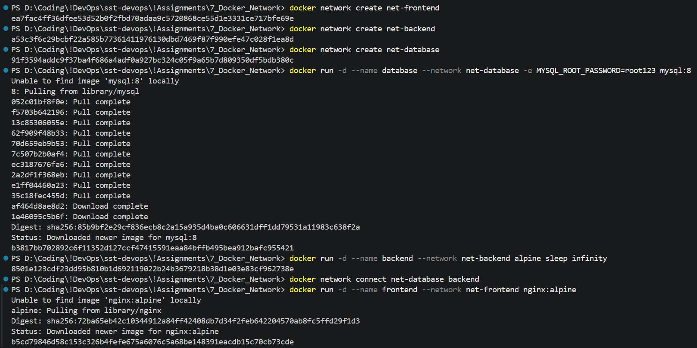
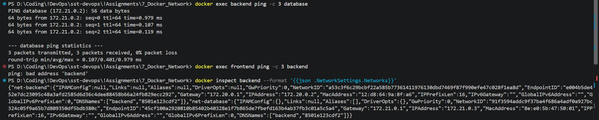
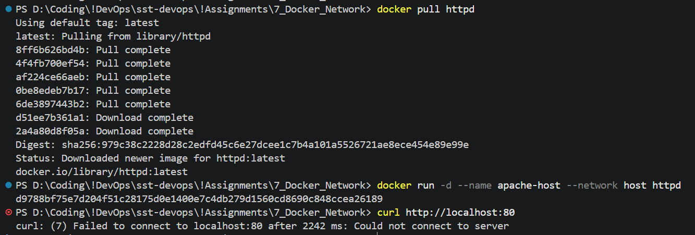
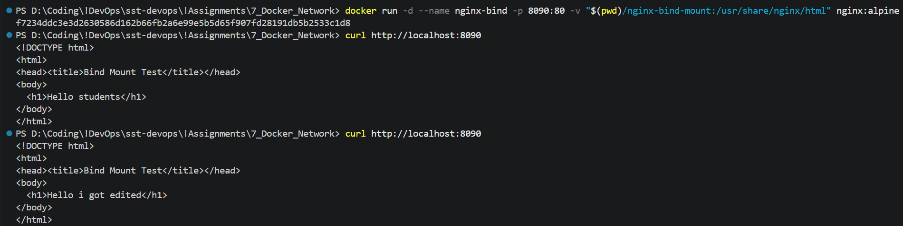

# Task 1: Docker Container Networking

# Task 2: Host Network

### AI Assisted Note for it not working
(Note: Docker Desktop on Windows runs via a VM, so --network host behaves like bridge mode there — port 80 is still reachable at localhost:80, but true host-networking semantics only apply on native Linux. Mention this caveat if asked.)

T2.png shows the curl failed — curl: (7) Failed to connect to localhost:80. This confirms the caveat I mentioned earlier: on Docker Desktop for Windows, --network host doesn't actually bind to your Windows localhost because Docker runs inside a VM (WSL2), so host-networking semantics don't apply the same way as on native Linux. To fix and get real evidence for this task, drop --network host and just publish the port normally

# Task 3: Bind Mount

# Task 4: Overlay Network

## Research Notes

**What is an overlay network?**
A Docker network driver that lets containers running on *different* Docker hosts (a Swarm cluster) communicate as if they were on the same network. Docker creates a virtual network on top of the existing host network (hence "overlay"), using VXLAN encapsulation to tunnel container traffic between hosts.

**Use cases:**
- Multi-host container communication in a Docker Swarm cluster (services on different nodes reaching each other by service name).
- Service discovery and load balancing across nodes via Swarm's built-in DNS and routing mesh.
- Isolating groups of services on their own private network even when spread across many physical/virtual machines.
- Encrypted control-plane and optional data-plane traffic between hosts (`--opt encrypted`).

**How it works across multiple Docker hosts:**
1. Requires Swarm mode (`docker swarm init` / `docker swarm join`) — overlay networks are managed by the Swarm's built-in key-value store, unlike bridge networks which are local to one host.
2. Create with `docker network create -d overlay <name>` (add `--attachable` to let standalone `docker run` containers join too, not just services).
3. Each Docker host runs a VXLAN tunnel endpoint (VTEP); container traffic is encapsulated in VXLAN packets and sent over the hosts' existing physical/underlay network to the destination host, where it's decapsulated and delivered to the target container.
4. Swarm's internal DNS lets containers/services resolve each other by name regardless of which node they're scheduled on.
5. The ingress overlay network additionally provides the routing mesh, so a published service port is reachable on every node in the swarm, not just the node running the container.
