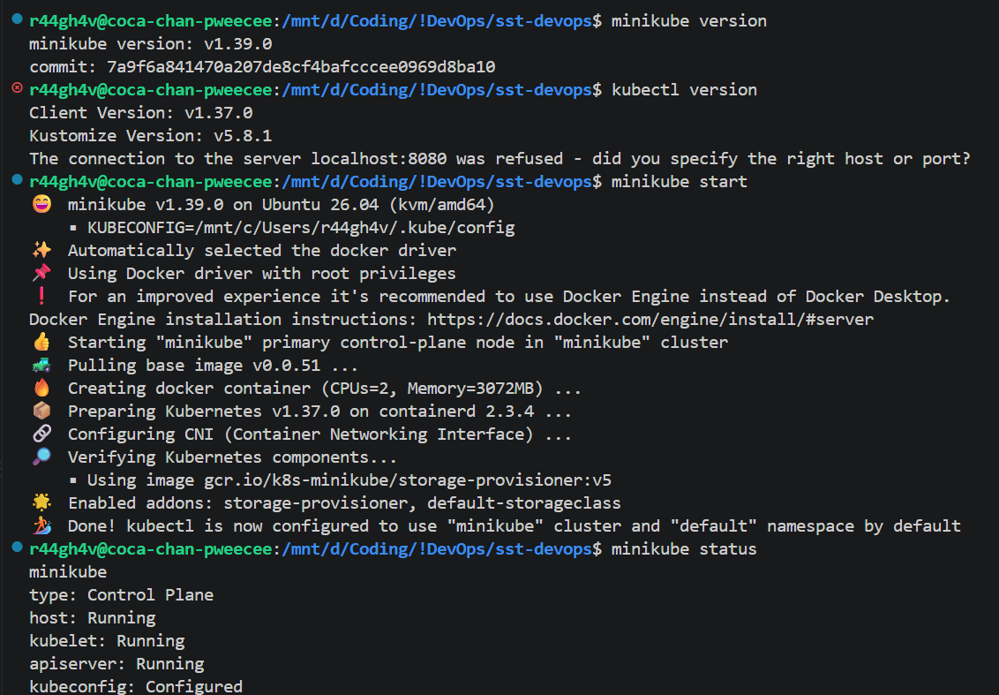
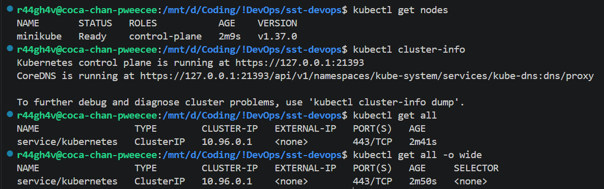

# Assignment 9 - Kubernetes Fundamentals

## 1. Minikube & kubectl Status

## 2. kubectl

## 3. Cluster Architecture

### Master node (control plane)

| Component | Job |
| :-- | :-- |
| etcd | Key-value database, stores every object's information |
| API server | Front door of the cluster, everything talks through it |
| Scheduler | Decides which node a pod runs on |
| Controller manager | Controls workloads via replicaset / daemonset / node controllers |

### Worker node

| Component | Job |
| :-- | :-- |
| kubelet | Sends pod heartbeat to API server, actually creates the pods |
| kube-proxy | Networking inside the node |
| CRI | Interface to run containers, default containerd |

Flow: API server → etcd stores it → scheduler picks a node → controller manager checks desired vs running → kubelet creates the pod and sends the heartbeat back.
