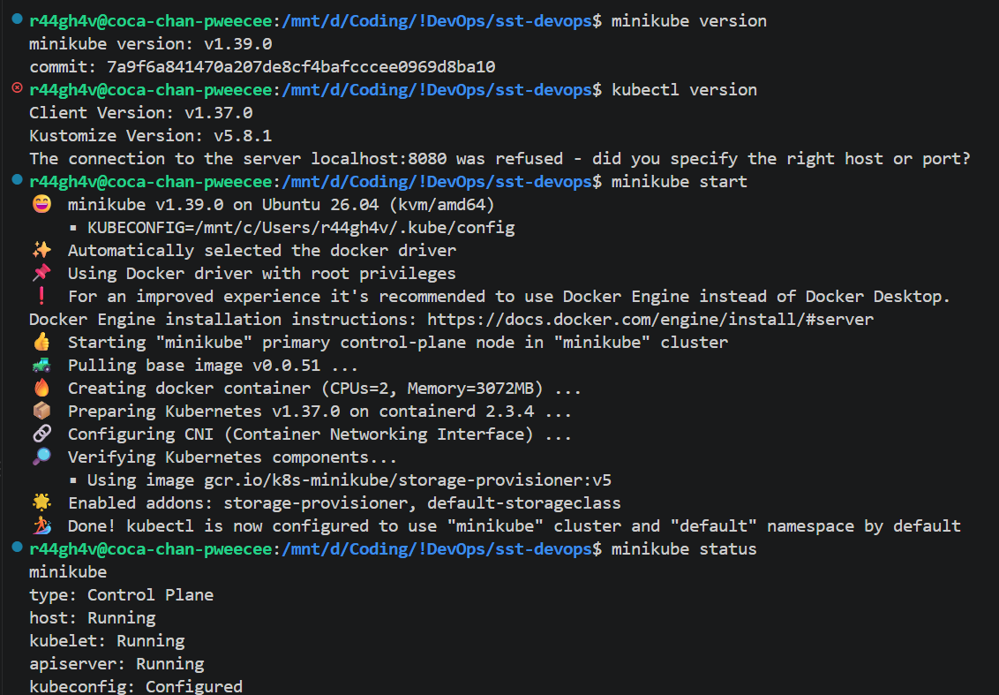
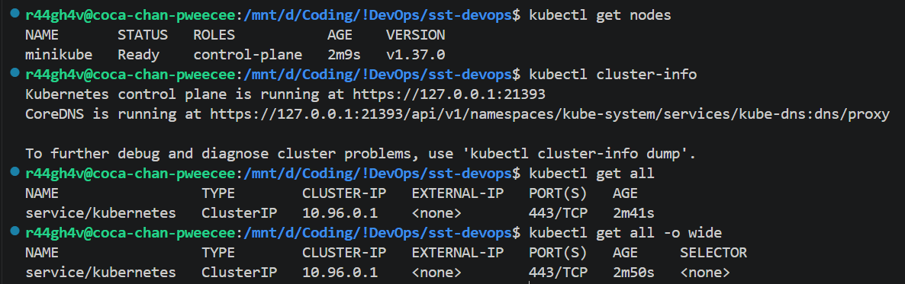

# Assignment 9 - Kubernetes Fundamentals

## 1. Minikube & kubectl Status



## 2. kubectl


## 3. Cluster Architecture

### Master node (control plane)

| Component | Job |
| :-- | :-- |
| etcd | Key-value database, stores every object's information |
| API server | Front door of the cluster, everything talks through it |
| Scheduler | Decides which node a pod runs on |
| Controller manager | Controls workloads via replicaset / daemonset / node controllers |

### Worker node

| Component | Job |
| :-- | :-- |
| kubelet | Sends pod heartbeat to API server, actually creates the pods |
| kube-proxy | Networking inside the node |
| CRI | Interface to run containers, default containerd |

Flow: API server → etcd stores it → scheduler picks a node → controller manager checks desired vs running → kubelet creates the pod and sends the heartbeat back.

## 4. Commands Used

```bash
minikube start                 # create the local single-node cluster
minikube status                # host / kubelet / apiserver running?
kubectl get nodes              # node is Ready
kubectl cluster-info           # API server and CoreDNS addresses
kubectl get all                # every object in the namespace
kubectl get all -o wide        # same, with IPs, nodes and selectors
```

## 5. Basic Kubernetes Objects

| Object | What it is |
| :-- | :-- |
| Pod | Smallest unit, wraps one or more containers sharing one IP. |
| ReplicaSet | Keeps N identical pods running. |
| Deployment | Manages ReplicaSets - rolling updates and rollback. |
| Service | Stable IP / DNS name in front of changing pods. |
| Namespace | Logical partition of the cluster (`default`, `kube-system`, `dev`). |
| ConfigMap / Secret | Configuration / sensitive data injected into pods. |
